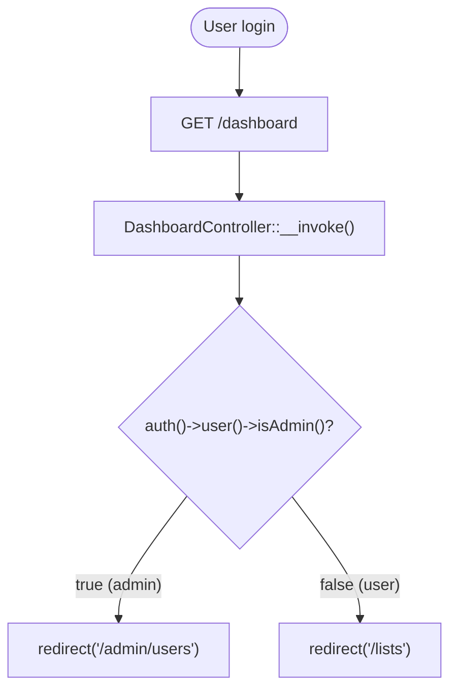
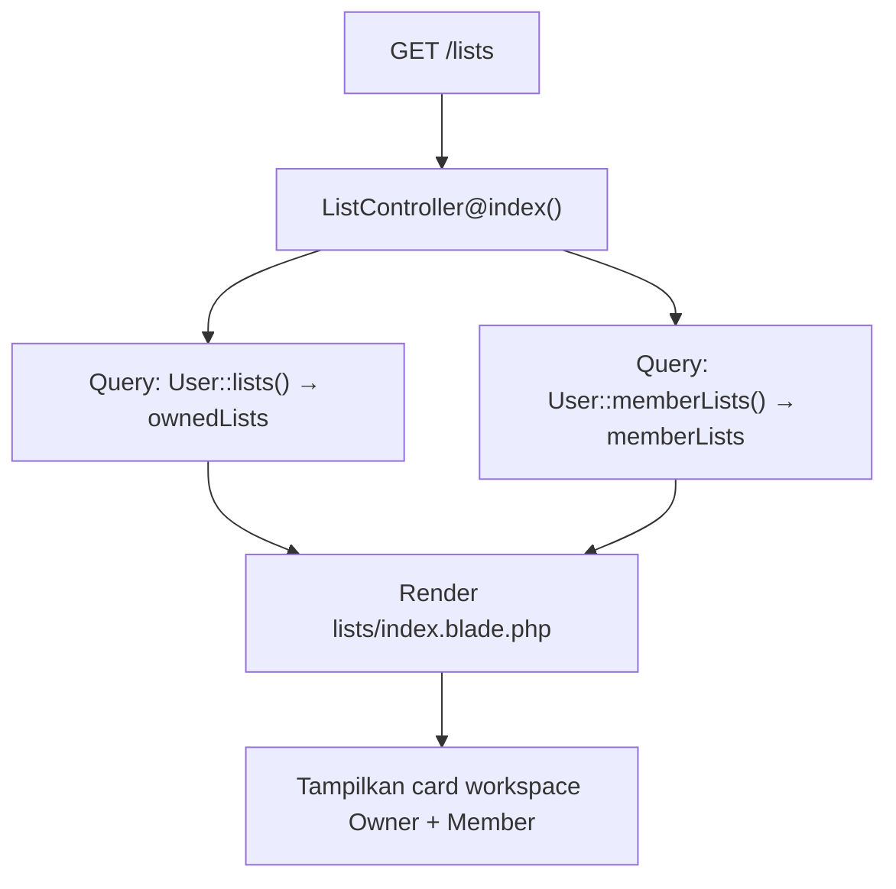
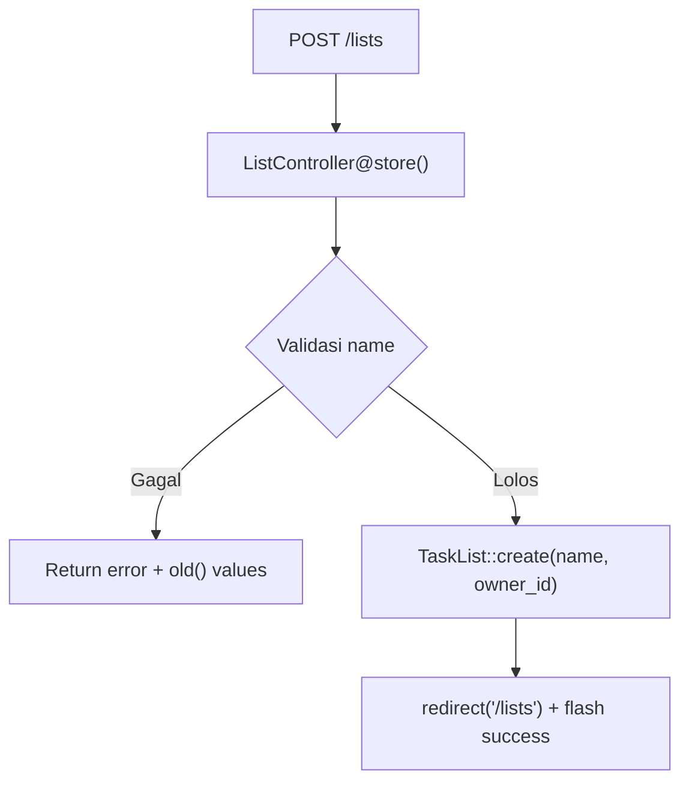
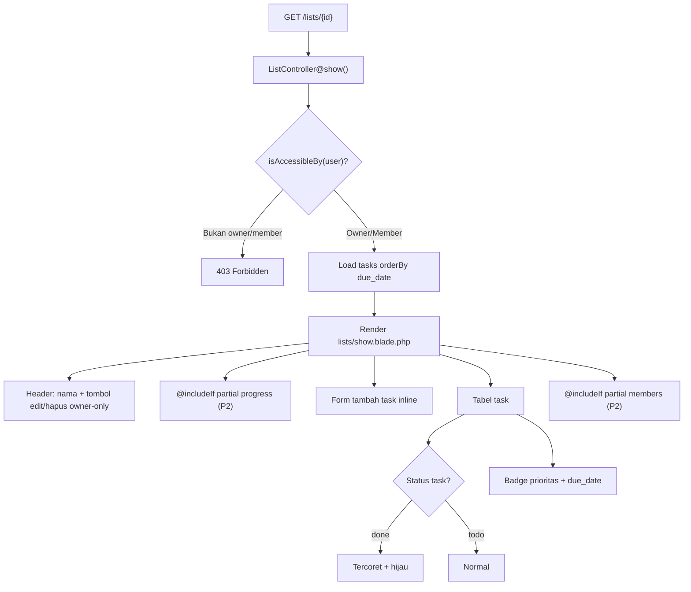
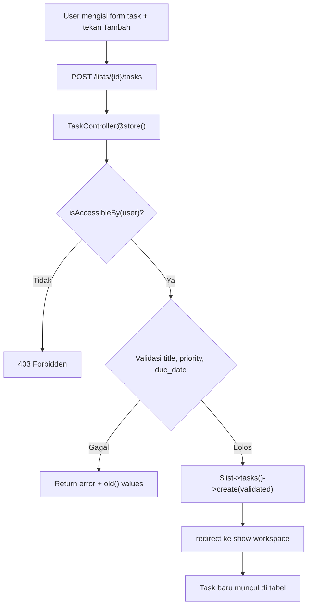
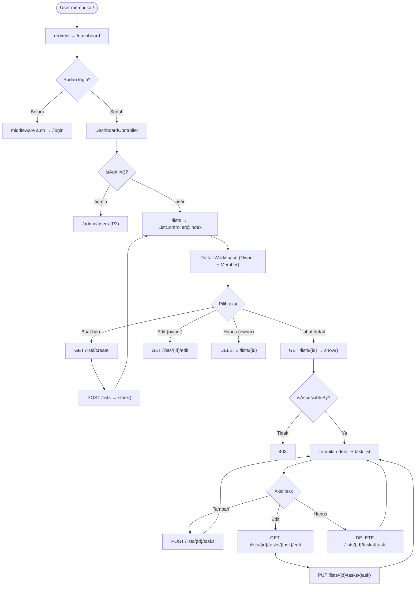
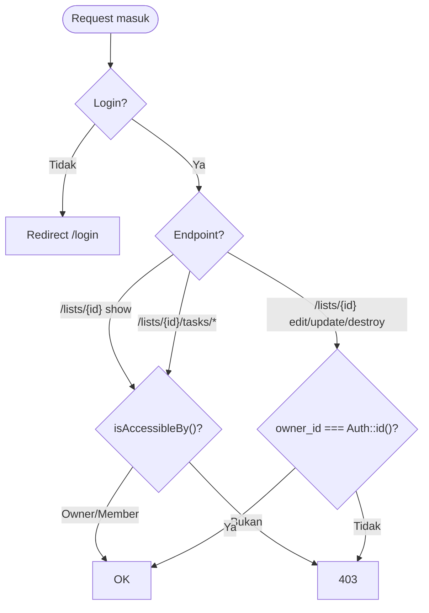
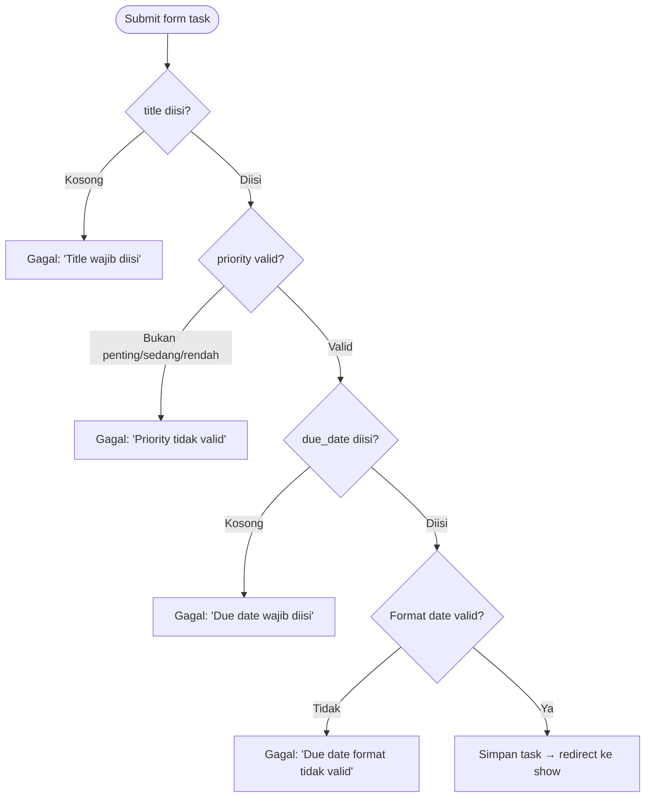

# CODEFLOW & WORKFLOW — Programmer 1

## Identitas

| Info               | Keterangan                                        |
|--------------------|---------------------------------------------------|
| **Peran**          | Programmer 1 (P1)                                 |
| **Nama**           | `[isi nama]`                                      |
| **Branch**         | `feature/auth-lists-tasks`                        |
| **SRS**            | SRS-001, SRS-002, SRS-003, SRS-004 (+ penyajian SRS-005) |
| **Stack**          | Laravel 13 + MySQL 8.0 + Blade + Bootstrap 5 CDN  |
| **Label UI**       | "Workspace" (entity/route tetap `lists`)           |

---

## BAB 1 — WORKFLOW: Langkah-Langkah Pengerjaan

### 1.1 Persiapan Awal

```
1. Membaca dokumen AI-PROGRAMMER1.md untuk memahami scope SRS yang harus dikerjakan.
2. Membaca CLAUDE.md (master prompt) dan AI-PROMPT.md untuk memahami kontrak antar-programmer.
3. Membaca README-Workflow-JARA.md untuk memahami keseluruhan workflow tim.
4. Mengecek codebase baseline yang sudah dibuat oleh PM:
   - Model: User, TaskList, Task (sudah ada relasi & helper)
   - Migration: users, lists, tasks, list_user (sudah jalan)
   - Seeder: AdminSeeder, DemoSeeder (sudah ada data demo)
   - Route: section [P1] dan [P2] masih kosong (hanya pembatas)
   - Layout: Bootstrap 5 CDN + navigation (sudah ada link My Workspace & User Management)
   - Auth: registrasi sudah ditutup oleh PM (route register dihapus)
```

### 1.2 Membuat Branch Fitur

```bash
git checkout -b feature/auth-lists-tasks
```

Semua pengerjaan dilakukan di branch `feature/auth-lists-tasks`. Tidak boleh mengubah branch `main` atau branch milik programmer lain.

### 1.3 Implementasi (berurutan mengikuti SRS)

```
SRS-001 → DashboardController (redirect pasca-login per role)
   ↓
SRS-002 → ListController (CRUD workspace) + 4 view blade
   ↓
SRS-003 → TaskController (CRUD task) + 1 view blade edit
   ↓
SRS-004 → Integrasi badge prioritas, due_date wajib, sorting, validasi di view show
   ↓
SRS-005 → Penyajian status task done (tercoret + hijau) di view show
```

### 1.4 Commit

```bash
git add routes/web.php app/Http/Controllers/ resources/views/
git commit -m "feat(P1): implementasi SRS-001 s.d. SRS-004 — auth redirect, workspace & task CRUD"
```

### 1.5 Hasil Commit

```
9 files changed, 474 insertions(+), 4 deletions(-)
```

### 1.6 Tidak Di-Push

Branch tetap di lokal. Push dilakukan oleh PM setelah merge.

---

## BAB 2 — STRUKTUR FILE

### 2.1 File yang Dibuat/Diubah

```
Praktikum1/
├── routes/
│   └── web.php                          ← DIUBAH: section [P1] diisi 11 route
│
├── app/Http/Controllers/
│   ├── DashboardController.php          ← BARU: SRS-001
│   ├── ListController.php               ← BARU: SRS-002 (82 baris)
│   └── TaskController.php               ← BARU: SRS-003 (61 baris)
│
└── resources/views/
    ├── lists/
    │   ├── index.blade.php              ← BARU: daftar workspace (52 baris)
    │   ├── create.blade.php             ← BARU: form buat workspace (29 baris)
    │   ├── edit.blade.php               ← BARU: form edit workspace (30 baris)
    │   └── show.blade.php               ← BARU: detail + task list (122 baris)
    └── tasks/
        └── edit.blade.php               ← BARU: form edit task (59 baris)
```

**Total: 8 file baru, 1 file diubah**

### 2.2 File Baseline yang DIHINDARI (tidak disentuh)

| File / Folder | Milik Siapa |
|---|---|
| `app/Models/*` | PM (baseline) |
| `database/migrations/*` | PM (baseline) |
| `database/seeders/*` | PM (baseline) |
| `bootstrap/app.php` | Programmer 2 (middleware admin) |
| `resources/views/lists/partials/*` | Programmer 2 (toggle, progress, members) |
| `app/Http/Controllers/Admin/*` | Programmer 2 |
| Section `[P2]` di `routes/web.php` | Programmer 2 |

---

## BAB 3 — CODEFLOW PER SRS

### 3.1 SRS-001: Authentication (Redirect Pasca-Login)

**File:** `app/Http/Controllers/DashboardController.php`

#### Kode

```php
class DashboardController extends Controller
{
    public function __invoke(): RedirectResponse
    {
        if (auth()->user()->isAdmin()) {
            return redirect('/admin/users');
        }

        return redirect('/lists');
    }
}
```

#### Penjelasan

- Menggunakan **single-action controller** (`__invoke`) karena hanya satu logika: redirect.
- `auth()->user()->isAdmin()` mengecek kolom `users.role === 'admin'` (method di model User).
- Admin → `/admin/users` (route milik P2, 404 di branch P1 — itu wajar).
- User biasa → `/lists` (workspace miliknya).
- Route `/register` sudah dihapus PM → otomatis 404.

#### Flowchart



#### Route

```php
Route::get('/dashboard', DashboardController::class)
    ->middleware('auth')
    ->name('dashboard');
```

---

### 3.2 SRS-002: Workspace (List) CRUD

**File:** `app/Http/Controllers/ListController.php`

#### 3.2.1 Index — Melihat Semua Workspace

**Kode Controller:**

```php
public function index(): View
{
    $user = Auth::user();

    $ownedLists = $user->lists()->withCount('tasks')->orderBy('name')->get();
    $memberLists = $user->memberLists()->withCount('tasks')->orderBy('name')->get();

    return view('lists.index', compact('ownedLists', 'memberLists'));
}
```

**Penjelasan:**
- Dua query terpisah: `$user->lists()` (workspace saya sebagai owner, relasi `hasMany` via `owner_id`) dan `$user->memberLists()` (workspace tempat saya jadi member, relasi `belongsToMany` via pivot `list_user`).
- `withCount('tasks')` menghasilkan atribut `tasks_count` di setiap item untuk ditampilkan di view.
- `orderBy('name')` mengurutkan workspace secara alfabetis.

**Kode View (`lists/index.blade.php`):**

```blade
@foreach ($ownedLists as $list)
    <div class="card">
        <a href="/lists/{{ $list->id }}">{{ $list->name }}</a>
        <small>{{ $list->tasks_count }} task</small>
        <span class="badge bg-primary">Owner</span>
    </div>
@endforeach

@foreach ($memberLists as $list)
    <div class="card">
        <a href="/lists/{{ $list->id }}">{{ $list->name }}</a>
        <small>{{ $list->tasks_count }} task</small>
        <span class="badge bg-secondary">Member</span>
    </div>
@endforeach
```

**Flowchart:**



---

#### 3.2.2 Create — Form Buat Workspace

**Kode Controller:**

```php
public function create(): View
{
    return view('lists.create');
}
```

**Kode View (`lists/create.blade.php`):**

```blade
<form method="POST" action="/lists">
    @csrf
    <input type="text" name="name" required maxlength="100" autofocus>
    <button type="submit">Simpan</button>
</form>
```

**Penjelasan:**
- Form POST ke `/lists` dengan CSRF token (`@csrf`).
- Input `name` wajib diisi, maks 100 karakter (sesuai `varchar(100)` di database).

---

#### 3.2.3 Store — Menyimpan Workspace Baru

**Kode Controller:**

```php
public function store(Request $request): RedirectResponse
{
    $validated = $request->validate([
        'name' => ['required', 'string', 'max:100'],
    ]);

    TaskList::create([
        'name' => $validated['name'],
        'owner_id' => Auth::id(),
    ]);

    return redirect('/lists')->with('success', 'Workspace berhasil dibuat.');
}
```

**Penjelasan:**
- Validasi server-side: `name` wajib, string, maks 100 karakter.
- `owner_id` diambil otomatis dari `Auth::id()` (user yang sedang login).
- Redirect ke index dengan flash message success.

**Flowchart:**



---

#### 3.2.4 Show — Melihat Detail Workspace + Tasks

**Kode Controller:**

```php
public function show(TaskList $list): View
{
    abort_unless($list->isAccessibleBy(Auth::user()), 403);

    $list->load(['tasks' => function ($query) {
        $query->orderBy('due_date');
    }]);

    return view('lists.show', compact('list'));
}
```

**Penjelasan:**
- **Otorisasi:** `abort_unless($list->isAccessibleBy(Auth::user()), 403)` — hanya owner ATAU member yang boleh mengakses.
- Method `isAccessibleBy()` ada di model `TaskList`:
  ```php
  public function isAccessibleBy(User $user): bool
  {
      return $this->owner_id === $user->id
          || $this->members()->whereKey($user->id)->exists();
  }
  ```
- Eager load tasks dengan `orderBy('due_date')` → task diurutkan tenggat terdekat.

**Kode View (`lists/show.blade.php`) — Komponen Utama:**

```blade
{{-- 1. Header: nama workspace + tombol Edit/Hapus (owner only) --}}
<h4>{{ $list->name }}</h4>
@if ($list->owner_id === auth()->id())
    <a href="/lists/{{ $list->id }}/edit">Edit</a>
    <form method="POST" action="/lists/{{ $list->id }}">
        @csrf @method('DELETE')
        <button>Hapus</button>
    </form>
@endif

{{-- 2. Partial progress (milik P2, aman via @includeIf) --}}
@includeIf('lists.partials.progress', ['list' => $list])

{{-- 3. Form tambah task inline --}}
<form method="POST" action="/lists/{{ $list->id }}/tasks">
    <input name="title" required>
    <select name="priority"> penting | sedang | rendah </select>
    <input type="date" name="due_date" required>
    <input name="description" placeholder="opsional">
    <button>Tambah</button>
</form>

{{-- 4. Tabel task --}}
@foreach ($list->tasks as $task)
    <tr>
        {{-- SRS-005: task done tampil tercoret + hijau --}}
        <td class="{{ $task->status === 'done' ? 'text-decoration-line-through text-success' : '' }}">
            {{ $task->title }}
            @includeIf('lists.partials.toggle', ['task' => $task])
        </td>

        {{-- SRS-004: badge prioritas --}}
        <td>
            @if ($task->priority === 'penting')   <span class="badge bg-danger">Penting</span>
            @elseif ($task->priority === 'sedang') <span class="badge bg-warning text-dark">Sedang</span>
            @else                                  <span class="badge bg-secondary">Rendah</span>
            @endif
        </td>

        {{-- SRS-004: tenggat merah jika sudah lewat --}}
        <td class="{{ $task->due_date->isPast() ? 'text-danger fw-bold' : '' }}">
            {{ $task->due_date->format('d M Y') }}
        </td>

        {{-- Aksi --}}
        <td>
            <a href="/lists/{{ $list->id }}/tasks/{{ $task->id }}/edit">Edit</a>
            <form method="POST" action="/lists/{{ $list->id }}/tasks/{{ $task->id }}">
                @csrf @method('DELETE')
                <button>Hapus</button>
            </form>
        </td>
    </tr>
@endforeach

{{-- 5. Partial members (milik P2, aman via @includeIf) --}}
@includeIf('lists.partials.members', ['list' => $list])
```

**Flowchart Show Workspace:**



---

#### 3.2.5 Edit & Update — Mengubah Workspace

**Kode Controller:**

```php
public function edit(TaskList $list): View
{
    abort_unless($list->owner_id === Auth::id(), 403);
    return view('lists.edit', compact('list'));
}

public function update(Request $request, TaskList $list): RedirectResponse
{
    abort_unless($list->owner_id === Auth::id(), 403);

    $validated = $request->validate([
        'name' => ['required', 'string', 'max:100'],
    ]);

    $list->update($validated);

    return redirect('/lists/' . $list->id)->with('success', 'Workspace berhasil diperbarui.');
}
```

**Penjelasan:**
- **Hanya owner** yang boleh edit/update (`$list->owner_id === Auth::id()`).
- Bukan owner → `abort(403)`.
- Validasi name wajib, maks 100 karakter.
- Redirect ke halaman detail workspace setelah berhasil.

**Kode View (`lists/edit.blade.php`):**

```blade
<form method="POST" action="/lists/{{ $list->id }}">
    @csrf
    @method('PUT')
    <input name="name" value="{{ old('name', $list->name) }}" required maxlength="100">
    <button type="submit">Perbarui</button>
</form>
```

---

#### 3.2.6 Destroy — Menghapus Workspace

**Kode Controller:**

```php
public function destroy(TaskList $list): RedirectResponse
{
    abort_unless($list->owner_id === Auth::id(), 403);

    $list->delete();

    return redirect('/lists')->with('success', 'Workspace berhasil dihapus.');
}
```

**Penjelasan:**
- Hanya owner yang boleh menghapus.
- `$list->delete()` akan cascade menghapus semua tasks dan data pivot `list_user` (sudah diatur di migration dengan `cascadeOnDelete`).
- Redirect ke index workspace.

**Kode View (tombol hapus di `lists/show.blade.php`):**

```blade
<form method="POST" action="/lists/{{ $list->id }}"
      onsubmit="return confirm('Yakin ingin menghapus workspace ini? Semua task di dalamnya juga akan terhapus.');">
    @csrf
    @method('DELETE')
    <button type="submit" class="btn btn-outline-danger btn-sm">Hapus</button>
</form>
```

---

### 3.3 SRS-003: Task CRUD

**File:** `app/Http/Controllers/TaskController.php`

#### 3.3.1 Store — Menambah Task

**Kode:**

```php
public function store(Request $request, TaskList $list): RedirectResponse
{
    abort_unless($list->isAccessibleBy(Auth::user()), 403);

    $validated = $request->validate([
        'title'       => ['required', 'string', 'max:255'],
        'description' => ['nullable', 'string', 'max:1000'],
        'priority'    => ['required', 'in:penting,sedang,rendah'],
        'due_date'    => ['required', 'date'],
    ]);

    $list->tasks()->create($validated);

    return redirect('/lists/' . $list->id)->with('success', 'Task berhasil ditambahkan.');
}
```

**Penjelasan:**
- **Otorisasi:** Owner DAN member boleh menambah task (selama `isAccessibleBy` true).
- **Validasi:**
  - `title`: wajib diisi, maks 255 karakter.
  - `description`: opsional (nullable), maks 1000 karakter.
  - `priority`: wajib, salah satu dari `penting`, `sedang`, `rendah`.
  - `due_date`: **WAJIB diisi** (`required|date`) — tidak boleh kosong.
- `$list->tasks()->create($validated)` → otomatis mengisi `list_id` dari relasi.
- Redirect ke halaman detail workspace.

**Form Tambah Task (di `lists/show.blade.php`):**

```blade
<form method="POST" action="/lists/{{ $list->id }}/tasks">
    @csrf
    <input name="title" placeholder="Judul task" required>
    <select name="priority">
        <option value="penting">Penting</option>
        <option value="sedang" selected>Sedang</option>  ← default
        <option value="rendah">Rendah</option>
    </select>
    <input type="date" name="due_date" value="{{ date('Y-m-d') }}" required>
    <input name="description" placeholder="Deskripsi (opsional)">
    <button>Tambah</button>
</form>
```

**Flowchart:**



---

#### 3.3.2 Edit & Update — Mengubah Task

**Kode:**

```php
public function edit(TaskList $list, Task $task): View
{
    abort_unless($list->isAccessibleBy(Auth::user()), 403);
    return view('tasks.edit', compact('list', 'task'));
}

public function update(Request $request, TaskList $list, Task $task): RedirectResponse
{
    abort_unless($list->isAccessibleBy(Auth::user()), 403);

    $validated = $request->validate([
        'title'       => ['required', 'string', 'max:255'],
        'description' => ['nullable', 'string', 'max:1000'],
        'priority'    => ['required', 'in:penting,sedang,rendah'],
        'due_date'    => ['required', 'date'],
    ]);

    $task->update($validated);

    return redirect('/lists/' . $list->id)->with('success', 'Task berhasil diperbarui.');
}
```

**Penjelasan:**
- Owner DAN member boleh mengedit task (selama `isAccessibleBy` true).
- Validasi sama dengan store.
- `$task->update($validated)` memperbarui semua field task.

**Kode View (`tasks/edit.blade.php`):**

```blade
<form method="POST" action="/lists/{{ $list->id }}/tasks/{{ $task->id }}">
    @csrf
    @method('PUT')
    <input name="title" value="{{ old('title', $task->title) }}" required>
    <textarea name="description">{{ old('description', $task->description) }}</textarea>
    <select name="priority">
        <option value="penting" {{ old('priority', $task->priority) === 'penting' ? 'selected' : '' }}>Penting</option>
        <option value="sedang" {{ old('priority', $task->priority) === 'sedang' ? 'selected' : '' }}>Sedang</option>
        <option value="rendah" {{ old('priority', $task->priority) === 'rendah' ? 'selected' : '' }}>Rendah</option>
    </select>
    <input type="date" name="due_date" value="{{ old('due_date', $task->due_date->format('Y-m-d')) }}" required>
    <button>Perbarui</button>
</form>
```

---

#### 3.3.3 Destroy — Menghapus Task

**Kode:**

```php
public function destroy(TaskList $list, Task $task): RedirectResponse
{
    abort_unless($list->isAccessibleBy(Auth::user()), 403);

    $task->delete();

    return redirect('/lists/' . $list->id)->with('success', 'Task berhasil dihapus.');
}
```

**Kode View (tombol hapus di `lists/show.blade.php`):**

```blade
<form method="POST" action="/lists/{{ $list->id }}/tasks/{{ $task->id }}"
      onsubmit="return confirm('Yakin ingin menghapus task ini?');">
    @csrf
    @method('DELETE')
    <button type="submit" class="btn btn-outline-danger btn-sm">Hapus</button>
</form>
```

---

### 3.4 SRS-004: Prioritas & Tenggat Waktu

SRS-004 diimplementasikan di dalam **view** (`lists/show.blade.php` dan `tasks/edit.blade.php`), bukan controller terpisah.

#### 3.4.1 Badge Prioritas

```blade
@if ($task->priority === 'penting')
    <span class="badge bg-danger">Penting</span>          ← merah
@elseif ($task->priority === 'sedang')
    <span class="badge bg-warning text-dark">Sedang</span> ← kuning
@else
    <span class="badge bg-secondary">Rendah</span>        ← abu-abu
@endif
```

| Nilai | Warna Badge | CSS Class |
|---|---|---|
| `penting` | Merah | `bg-danger` |
| `sedang` | Kuning | `bg-warning text-dark` |
| `rendah` | Abu-abu | `bg-secondary` |

#### 3.4.2 Tenggat Waktu (due_date WAJIB)

**Server-side (validasi):**

```php
'due_date' => ['required', 'date'],  // TIDAK BOLEH KOSONG
```

**Client-side (form):**

```blade
<input type="date" name="due_date" value="{{ date('Y-m-d') }}" required>
```

**Tampilan di tabel:**

```blade
<td class="{{ $task->due_date->isPast() ? 'text-danger fw-bold' : '' }}">
    {{ $task->due_date->format('d M Y') }}
</td>
```

- `$task->due_date` ter-cast ke `Carbon` via method `casts()` di model Task → bisa panggil `->isPast()`.
- Jika tanggal sudah lewat → teks merah + bold (`text-danger fw-bold`).

#### 3.4.3 Sorting by Due Date Terdekat

Task diurutkan otomatis berdasarkan `due_date` terdekat → diatur di model `TaskList`:

```php
// app/Models/TaskList.php
public function tasks(): HasMany
{
    return $this->hasMany(Task::class, 'list_id')->orderBy('due_date');
}
```

---

### 3.5 SRS-005 — Bagian Penyajian (Interaksi Toggle = Milik P2)

Di halaman `lists/show.blade.php`, baris task menampilkan **status visual**:

```blade
<td class="{{ $task->status === 'done' ? 'text-decoration-line-through text-success' : '' }}">
    {{ $task->title }}
    @includeIf('lists.partials.toggle', ['task' => $task])
</td>
```

| Status | Tampilan |
|---|---|
| `todo` | Teks normal |
| `done` | Teks tercoret (`text-decoration-line-through`) + hijau (`text-success`) |

Tombol toggle (interaksi) via `@includeIf('lists.partials.toggle')` → partial milik P2. Sebelum merge, tombol belum muncul (wajar by design).

---

## BAB 4 — DIAGRAM ALUR UTAMA (MERMAID)

### 4.1 Alur Keseluruhan Aplikasi dari Sisi P1



### 4.2 Alur Otorisasi



### 4.3 Alur Validasi Task



---

## BAB 5 — TABEL ROUTE LENGKAP

| Method   | URI                                 | Nama Route        | Controller & Method          | SRS   |
|----------|-------------------------------------|-------------------|------------------------------|-------|
| GET      | `/`                                 | —                 | redirect `/dashboard`        | 001   |
| GET      | `/dashboard`                        | `dashboard`       | `DashboardController@__invoke` | 001 |
| GET      | `/lists`                            | `lists.index`     | `ListController@index`       | 002   |
| GET      | `/lists/create`                     | `lists.create`    | `ListController@create`      | 002   |
| POST     | `/lists`                            | `lists.store`     | `ListController@store`       | 002   |
| GET      | `/lists/{list}`                     | `lists.show`      | `ListController@show`        | 002   |
| GET      | `/lists/{list}/edit`                | `lists.edit`      | `ListController@edit`        | 002   |
| PUT      | `/lists/{list}`                     | `lists.update`    | `ListController@update`      | 002   |
| DELETE   | `/lists/{list}`                     | `lists.destroy`   | `ListController@destroy`     | 002   |
| POST     | `/lists/{list}/tasks`               | `tasks.store`     | `TaskController@store`       | 003   |
| GET      | `/lists/{list}/tasks/{task}/edit`   | `tasks.edit`      | `TaskController@edit`        | 003   |
| PUT      | `/lists/{list}/tasks/{task}`        | `tasks.update`    | `TaskController@update`      | 003   |
| DELETE   | `/lists/{list}/tasks/{task}`        | `tasks.destroy`   | `TaskController@destroy`     | 003   |

Semua route di atas berada di dalam group `middleware('auth')`.

---

## BAB 6 — OTORISASI & KEAMANAN

### 6.1 Siapa Boleh Melakukan Apa

| Aksi                       | Siapa Boleh?             | Mekanisme                                    | Error |
|----------------------------|--------------------------|----------------------------------------------|-------|
| Lihat daftar workspace     | User login               | `middleware('auth')`                          | —     |
| Lihat detail workspace     | Owner **atau** Member    | `$list->isAccessibleBy(Auth::user())`         | 403   |
| Buat workspace baru        | User login               | `Auth::id()` sebagai `owner_id`              | —     |
| Edit workspace             | **Hanya Owner**          | `$list->owner_id === Auth::id()`              | 403   |
| Hapus workspace            | **Hanya Owner**          | `$list->owner_id === Auth::id()`              | 403   |
| Tambah task                | Owner **atau** Member    | `$list->isAccessibleBy(Auth::user())`         | 403   |
| Edit task                  | Owner **atau** Member    | `$list->isAccessibleBy(Auth::user())`         | 403   |
| Hapus task                 | Owner **atau** Member    | `$list->isAccessibleBy(Auth::user())`         | 403   |
| Akses `/register`          | Tidak ada                | Route register dihapus PM di baseline         | 404   |

### 6.2 Method Otorisasi di Model (Baseline PM)

```php
// app/Models/TaskList.php
public function isAccessibleBy(User $user): bool
{
    return $this->owner_id === $user->id                              // saya owner
        || $this->members()->whereKey($user->id)->exists();           // atau saya member
}
```

### 6.3 Mekanisme Keamanan Lain

| Mekanisme | Penerapan |
|---|---|
| **CSRF Token** | `@csrf` di semua form POST/PUT/DELETE |
| **Validation** | Server-side di setiap store/update controller |
| **Mass Assignment Protection** | `$fillable` di semua model (baseline PM) |
| **URL Literal** | Navigasi pakai `/lists`, `/admin/users` — bukan `route()` — agar aman diuji per branch |
| **Confirm Dialog** | `onsubmit="return confirm(...)"` di tombol hapus |

---

## BAB 7 — KONTRAK DENGAN PROGRAMMER 2

### 7.1 Partial yang Dipanggil dengan @includeIf

Di `lists/show.blade.php`, P1 memanggil 3 partial milik P2:

```blade
@includeIf('lists.partials.progress', ['list' => $list])   ← progress bar
@includeIf('lists.partials.toggle', ['task' => $task])      ← tombol toggle per task
@includeIf('lists.partials.members', ['list' => $list])     ← daftar anggota
```

**Kenapa aman?**
- `@includeIf` akan **render partial jika file ada**.
- Jika file **belum ada** (belum merge P2), `@includeIf` **diam/tidak error**.
- Setelah merge P2, partial akan otomatis muncul tanpa perubahan kode P1.

### 7.2 File yang Tidak Boleh Disentuh P1

| File / Folder | Alasan |
|---|---|
| `app/Models/*` | Milik baseline PM |
| `database/migrations/*` | Milik baseline PM |
| `bootstrap/app.php` | Hanya P2 yang boleh ubah (alias middleware admin) |
| `resources/views/lists/partials/*` | Milik P2 (toggle, progress, members) |
| `app/Http/Controllers/Admin/*` | Milik P2 |
| Section `[P2]` di `routes/web.php` | Milik P2 |

---

## BAB 8 — CHECKLIST VERIFIKASI

### 8.1 SRS-001: Authentication

| # | Skenario | Hasil |
|---|---|---|
| 1 | Buka `/register` → 404 (registrasi ditutup) | V |
| 2 | Login `admin@jara.test` → redirect ke `/admin/users` | V |
| 3 | Login `budi@jara.test` → redirect ke `/lists` | V |
| 4 | Logout → halaman auth terkunci tanpa login | V |
| 5 | Buka `/dashboard` tanpa login → redirect ke `/login` | V |

### 8.2 SRS-002: Workspace CRUD

| # | Skenario | Hasil |
|---|---|---|
| 6 | Buka `/lists` → tampil workspace Owner + badge "Owner" | V |
| 7 | Buka `/lists` → tampil workspace Member + badge "Member" | V |
| 8 | Klik "+ Buat Workspace" → form → isi name → Simpan → workspace baru muncul | V |
| 9 | Klik workspace → tampil detail + tasks | V |
| 10 | Owner klik Edit → ubah nama → Simpan → nama berubah | V |
| 11 | Owner klik Hapus → confirm → workspace + tasks terhapus (cascade) | V |
| 12 | Buka workspace orang lain (bukan member) → 403 Forbidden | V |
| 13 | Member buka workspace → bisa lihat tapi tidak ada tombol Edit/Hapus | V |

### 8.3 SRS-003: Task CRUD

| # | Skenario | Hasil |
|---|---|---|
| 14 | Isi form task (title + priority + due_date) → Tambah → task baru muncul | V |
| 15 | Submit task TANPA title → ditolak validasi | V |
| 16 | Submit task TANPA due_date → ditolak validasi | V |
| 17 | Submit task TANPA priority → ditolak validasi | V |
| 18 | Klik Edit task → form terisi data lama → ubah → Simpan → berubah | V |
| 19 | Klik Hapus task → confirm → task terhapus | V |

### 8.4 SRS-004: Prioritas & Tenggat

| # | Skenario | Hasil |
|---|---|---|
| 20 | Task prioritas "Penting" → badge merah (`bg-danger`) | V |
| 21 | Task prioritas "Sedang" → badge kuning (`bg-warning`) | V |
| 22 | Task prioritas "Rendah" → badge abu (`bg-secondary`) | V |
| 23 | Task dengan due_date sudah lewat → teks merah bold | V |
| 24 | Task dengan due_date masih depan → teks normal | V |
| 25 | Task diurutkan due_date terdekat ke terjauh | V |
| 26 | Default priority saat tambah task = "Sedang" | V |

### 8.5 SRS-005 (Penyajian)

| # | Skenario | Hasil |
|---|---|---|
| 27 | Task berstatus `done` (dari seeder) → judul tercoret + hijau | V |
| 28 | `@includeIf('lists.partials.toggle')` tidak error meski file belum ada | V |

---

## BAB 9 — GIT LOG

```
*   f3b35b0 merge: P2 status, kolaborasi, progres & admin (SRS-005 s.d. SRS-008)
|\  
| * e68e31e feat(P2): implement admin user management and collaboration features
* |   a1a469b merge: P1 auth, workspace & task CRUD (SRS-001 s.d. SRS-004)
|\ \  
| |/  
|/|   
| * 9872340 feat(P1): implementasi SRS-001 s.d. SRS-004 — auth redirect, workspace & task CRUD
|/  
* e4153bd chore: baseline scaffold JARA (Laravel 13 + MySQL 8.0, registrasi tertutup)
* c939653 first commit
```

Commit P1: `9872340` — 9 file, 474 baris ditambahkan.
