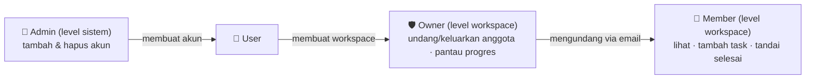
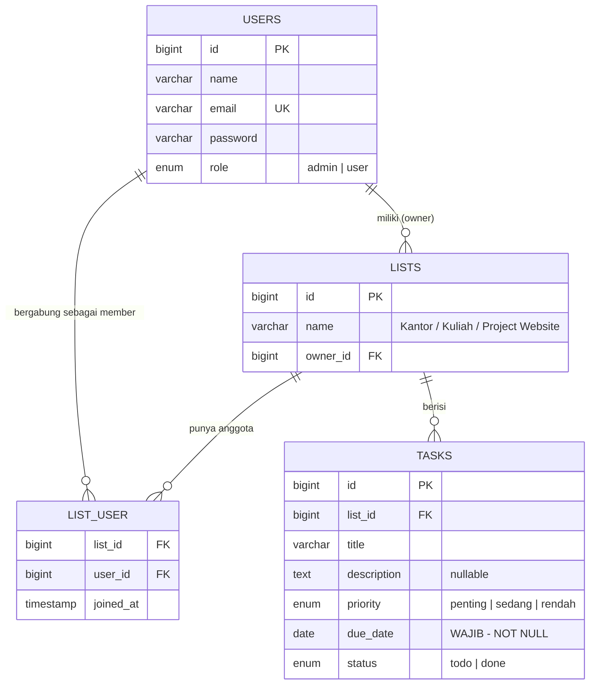
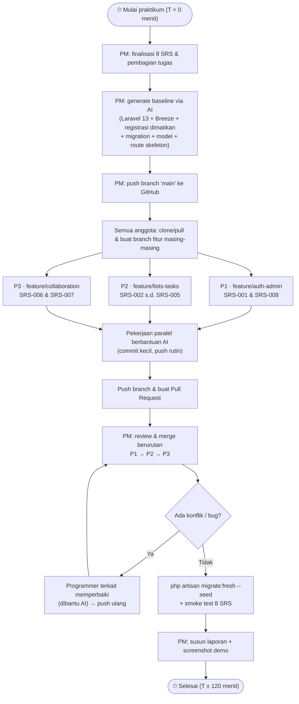
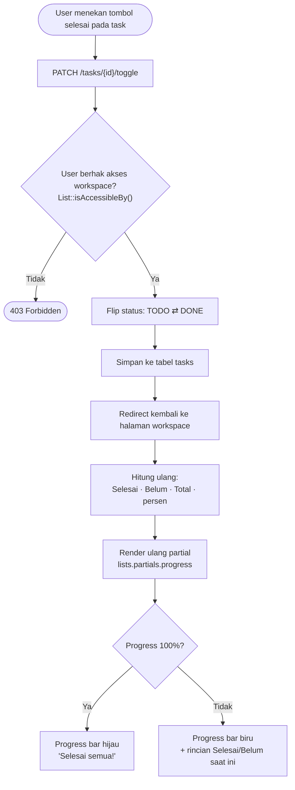
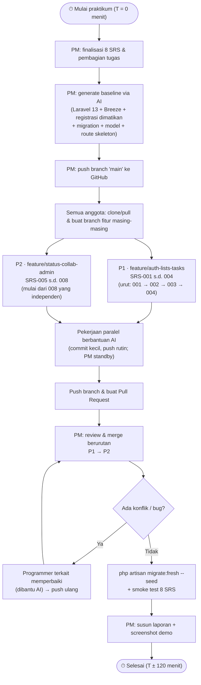
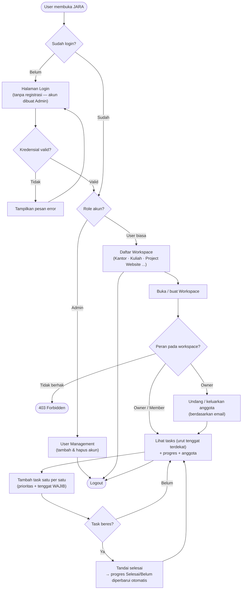
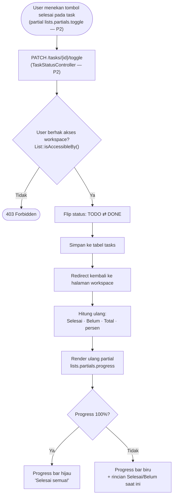
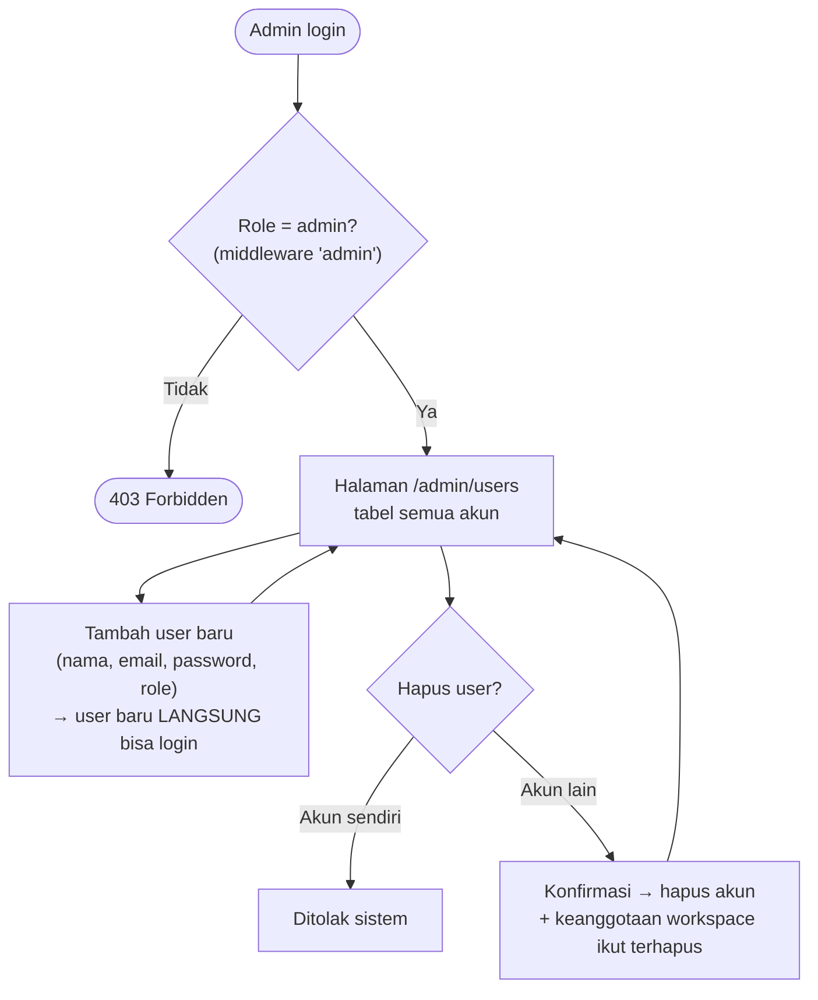

````markdown
# 📋 WORKFLOW LAPORAN PRAKTIKUM PPK-1 — PROYEK JARA (Advanced To-Do List)

| Info | Keterangan |
|---|---|
| Kelompok | `[isi nomor kelompok]` |
| Anggota | PM: `[nama]` · Programmer 1: `[nama]` · Programmer 2: `[nama]` · Programmer 3: `[nama]` |
| Studi kasus | Pertemuan 2 PPK — *JARA, an advanced to-do list* (disesuaikan ke user story kelompok) |
| Stack | Laravel 13 · MySQL Server 8.0 · Templating Blade · Laravel Breeze (stack Blade) · Bootstrap 5 (CDN) · Git/GitHub |
| PHP | ≥ 8.3 (cek `php -v` — sesuaikan dengan syarat resmi Laravel 13) |
| Durasi | ± 2 jam |
| Alat bantu | Agentic AI (Cursor / Claude Code / Copilot / chat AI) — prompt siap pakai di `AI-PROMPTS.md` |

> Diagram **Mermaid** otomatis ter-render di GitHub dan VS Code (ekstensi *Markdown Preview Mermaid*).

---

## 1. Ringkasan User Story (versi kelompok kami)

JARA adalah aplikasi web untuk mengatur tugas yang dapat **dipakai sendiri maupun bersama tim**.
Satu pengguna memiliki **banyak workspace/daftar** — misalnya *Kantor, Kuliah, Project Website*.
Di dalam setiap workspace pengguna **menambahkan tugas satu per satu**; setiap tugas **wajib
memiliki tenggat waktu** dan dapat **diberi prioritas (penting/sedang/rendah)**; tugas yang
beres **ditandai selesai oleh pengguna**. **Pemilik workspace** dapat **mengundang pengguna
lain** untuk bekerja di workspace yang sama, serta **memantau tugas mana yang sudah selesai,
belum, dan bagaimana perkembangan timnya**. **Tidak sembarang orang dapat memakai aplikasi**:
registrasi mandiri ditutup — akun hanya **dibuat dan dihapus oleh Admin**. Terdapat **3 peran:
Admin, Owner (pemilik workspace), dan Member (anggota yang diundang)**.

## 2. Penyesuaian dari Studi Kasus & Brainstorming Awal (fungsi awal tetap utuh)

| # | Sebelumnya | Versi Ini | Alasan (user story) |
|---|---|---|---|
| 1 | 4 programmer + 1 PM | **3 programmer + PM** | struktur kelompok nyata |
| 2 | Auth manual | **Laravel Breeze (stack Blade)** | SRS-001 cepat selesai, fungsi penuh |
| 3 | Migration/model per programmer | **PM buat semua 1× di baseline** | minimalkan merge conflict |
| 4 | Route bebas | **Section `[P1]`/`[P2]`/`[P3]` di `web.php`** | batas scope jelas |
| 5 | View progress/members rawan bentrok | **Kontrak partial `@includeIf(...)`** | aman sebelum merge |
| 6 | SRS-008 oleh PM | **SRS-008 digabung ke Programmer 1** | PM memikul baseline + merge/laporan |
| 7 | Tanpa asisten AI | **Prompt personalisasi per role** | percepat + jaga konsistensi |
| 8 | Registrasi terbuka (default Breeze) | **Registrasi DITUTUP — akun hanya dibuat Admin** | *"tidak semua asal daftar pakai app"* |
| 9 | Tenggat waktu opsional (nullable) | **Tenggat WAJIB** (NOT NULL + validasi required) | *"tenggat waktu (wajib)"* |
| 10 | Prioritas low/medium/high | **Penting/Sedang/Rendah** (3 tingkat tetap ada) | *"prioritas; penting"* |
| 11 | Istilah "list/project" | UI menyebut **"Workspace"** (entity & route tetap `lists`) | user story memakai istilah workspace |

### 2.1 Model Tiga Peran (Admin · Owner · Member)

| Peran | Level | Hak utama | Cara memperoleh |
|---|---|---|---|
| 👑 **Admin** | sistem (`users.role = 'admin'`) | menambah & menghapus akun; akses `/admin/users` | di-seed / dibuat Admin lain |
| 🛡 **Owner** (pemilik workspace) | per workspace | buat/ubah/hapus workspace; undang & keluarkan anggota; pantau progres; semua hak member | pembuat workspace |
| 👥 **Member** (anggota) | per workspace | lihat task; tambah/ubah task; tandai selesai | diundang Owner (berdasarkan email) |

**Catatan desain:** peran Owner/Member melekat pada **workspace**, bukan pada akun — sehingga
satu user bisa menjadi Owner di workspace "Kantor" miliknya sekaligus Member di "Project Website"
milik orang lain (persis skenario user story). Kolom `users.role` hanya membedakan Admin vs user
biasa. *Pengembangan lanjutan (di luar scope 2 jam): statistik kontribusi per anggota membutuhkan
kolom penugasan task (`assigned_to`).*



## 3. Breakdown SRS (8 SRS — dipertahankan semuanya)

| ID | Nama SRS | Deskripsi | Aktor | PIC | Branch |
|---|---|---|---|---|---|
| SRS-001 | Authentication | Login & logout; **tanpa registrasi mandiri** — akun hanya dibuat Admin | User | Programmer 1 | `feature/auth-admin` |
| SRS-002 | Workspace Management | Buat, lihat, ubah, hapus workspace (list) | User (Owner) | Programmer 2 | `feature/lists-tasks` |
| SRS-003 | Task Management | Tambah task satu per satu; lihat, ubah, hapus task | User | Programmer 2 | `feature/lists-tasks` |
| SRS-004 | Prioritas & Tenggat Waktu | Prioritas (penting/sedang/rendah); **tenggat waktu WAJIB** | User | Programmer 2 | `feature/lists-tasks` |
| SRS-005 | Task Completion | Tandai selesai (todo ⇄ done) oleh user | User | Programmer 2 | `feature/lists-tasks` |
| SRS-006 | Kolaborasi Workspace | Owner mengundang/mengeluarkan anggota; anggota terlihat | Owner/Member | Programmer 3 | `feature/collaboration` |
| SRS-007 | Monitoring Progres | Tampilkan task **selesai / belum / total / persentase** progres | Owner/Member | Programmer 3 | `feature/collaboration` |
| SRS-008 | Administrasi Pengguna | Admin menambah & menghapus akun — **satu-satunya pintu akun baru** | Admin | Programmer 1 | `feature/auth-admin` |
| — | Baseline, integrasi & merge | Scaffold proyek, merge 3 branch, laporan | PM | PM | `main` |

### 3.1 Traceability: User Story → SRS

| Pernyataan user story | Dipenuhi oleh |
|---|---|
| Mengatur tugas untuk dipakai sendiri & bareng tim (JARA) | Seluruh sistem |
| Satu user punya banyak daftar: kantor, kuliah, project web-site | SRS-002 |
| Menambahkan tugas satu per satu di dalam daftar | SRS-003 |
| Tugas diberi prioritas (penting) | SRS-004 |
| Tenggat waktu — wajib | SRS-004 |
| Task beres ditandai selesai oleh user | SRS-005 |
| Owner mengundang orang lain ke workspace yang sama | SRS-006 |
| Owner memantau selesai / belum / perkembangan tim | SRS-007 |
| Tidak sembarang orang bisa memakai aplikasi | SRS-001 (registrasi ditutup) + SRS-008 |
| Admin: user management — add, delete | SRS-008 |
| 3 role: Admin, Owner, Member | Model peran §2.1 |

## 4. Struktur Tim, Branch & Kepemilikan File (kunci merge mulus)

Aturan emas praktikum: *programmer melaksanakan pekerjaan dari PM, tidak lebih maupun kurang.*

| Peran | Branch | Boleh membuat / mengubah | DILARANG menyentuh |
|---|---|---|---|
| PM | `main` | seluruh repo **hanya saat baseline & merge** | kode fitur programmer (kecuali resolve konflik) |
| P1 | `feature/auth-admin` | `app/Http/Controllers/Admin/**`, `EnsureUserIsAdmin.php`, `resources/views/admin/**`, **`DashboardController` + `dashboard.blade.php` (redirect pasca-login per role)**, section `[P1]` | migration, model, partial P3, section route lain |
| P2 | `feature/lists-tasks` | `ListController`, `TaskController`, `resources/views/lists/**` (kecuali `partials/`), `resources/views/tasks/**`, section `[P2]` | migration, model, `lists/partials/**`, admin, dashboard, section lain |
| P3 | `feature/collaboration` | `MemberController`, `lists/partials/members.blade.php`, `lists/partials/progress.blade.php`, section `[P3]` | migration, model, view non-partial, section lain |

## 5. Skema Database & ERD

### 5.1 Definisi tabel (dibuat sekali oleh PM di baseline — kompatibel MySQL 8.4+/9.x)

| Tabel | Kolom penting |
|---|---|
| `users` | `id`, `name`, `email` (unik), `password`, `role` ENUM('admin','user') DEFAULT 'user' *(Owner/Member ditentukan per workspace, lihat §2.1)* |
| `lists` | `id`, `name` varchar(100), `owner_id` → users.id (FK cascade) |
| `tasks` | `id`, `list_id` → lists.id (FK cascade), `title`, `description` (nullable), `priority` ENUM('penting','sedang','rendah') DEFAULT 'sedang', `due_date` DATE **NOT NULL (WAJIB)**, `status` ENUM('todo','done') DEFAULT 'todo' |
| `list_user` | `list_id` → lists.id, `user_id` → users.id, `joined_at` — pivot **many-to-many User ⇄ Workspace** |

### 5.2 ERD



### 5.3 Kontrak interface antar programmer (disediakan PM di baseline — jangan diubah)

- `User::isAdmin()` · `User::lists()` (workspace milikku) · `User::memberLists()` (tempat aku member)
- `List::isAccessibleBy(User $u): bool` → owner **atau** member
- `List::progressPercentage(): int` → `done / total × 100` (0 jika belum ada task)
- **Registrasi mandiri dinonaktifkan di baseline** (route & link register dihapus) — akun hanya lahir dari Admin (SRS-008).
- **Daftar task di halaman show workspace diurutkan berdasarkan `due_date` terdekat** (konsekuensi tenggat wajib).
- Partial milik P3 dipanggil P2 lewat `@includeIf('lists.partials.progress')` dan `@includeIf('lists.partials.members')` (aman dirender walau branch P3 belum di-merge).
- Navigasi layout memakai **URL literal** (`/lists`, `/admin/users`) — bukan `route()` — agar tidak error saat branch diuji terpisah.

## 6. Flowchart Alur Proses

### 6.1 Alur kerja tim (workflow pengerjaan ±2 jam)



### 6.2 Alur aplikasi JARA (sudut pandang pengguna)


### 6.3 Alur toggle status & pembaruan progres (SRS-005 + SRS-007)



### 6.4 Alur administrasi pengguna — satu-satunya pintu akun baru (SRS-008)


## 7. Rundown Pengerjaan (±2 jam)

| Menit | Aktivitas | PIC |
|---|---|---|
| 0–10 | Briefing; PM finalisasi pembagian & mulai generate **baseline** (programmer lain memahami SRS + siapkan prompt AI) | Semua |
| 10–25 | Baseline selesai & push `main`; anggota clone/pull, `php artisan serve` jalan, buat branch | PM → semua |
| 25–85 | **Implementasi paralel** per branch dengan bantuan AI; commit kecil + push rutin | P1, P2, P3 |
| 85–105 | **Merge bertahap** P1 → P2 → P3; resolve konflik (AI membantu) | PM + programmer terkait |
| 105–115 | `migrate:fresh --seed`, smoke test 8 SRS, perbaikan bug kecil | Semua |
| 115–120 | Screenshot bukti, finalisasi laporan/README, persiapan demo | PM |

## 8. Acceptance Criteria (checklist smoke test)

| SRS | Skenario uji (Given–When–Then) |
|---|---|
| 001 | Login sukses → logout → halaman ber-auth terkunci; **`/register` tidak tersedia (404)** — akun hanya bisa dibuat Admin |
| 002 | Buat workspace "Project Website" → muncul di index; owner rename; hapus dengan konfirmasi; orang lain **tidak** melihat workspace pribadiku |
| 003 | Dalam workspace: tambah task satu per satu; edit; hapus; judul kosong ditolak validasi |
| 004 | **Simpan task tanpa tenggat → DITOLAK validasi**; prioritas Penting → badge merah (Sedang kuning, Rendah abu); tenggat lewat hari ini → merah; task tampil urut tenggat terdekat |
| 005 | Toggle selesai → teks tercoret + hijau; toggle kembali → normal |
| 006 | Owner undang member by email → muncul di daftar anggota; member login → workspace muncul di index-nya; owner keluarkan member → hilang; member **tidak bisa** mengelola anggota |
| 007 | 2 dari 4 task selesai → tampil "Selesai 2 · Belum 2 · 50%"; naik/turun otomatis saat toggle; 100% → hijau "Selesai semua!" |
| 008 | Admin tambah user (dengan password) → user baru **langsung bisa login**; hapus user → hilang; hapus akun sendiri → ditolak; user biasa buka `/admin/users` → 403 |

## 9. Definition of Done

- [ ] Ketiga branch ter-merge ke `main` tanpa konflik tersisa
- [ ] Dari nol: `clone` → `composer install` → `.env` → `migrate --seed` → `serve` berjalan mulus
- [ ] 8/8 acceptance criteria lulus (§8) + tabel traceability §3.1 terbukti
- [ ] Laporan terisi: user story, SRS, model peran, flowchart, screenshot, `git log --oneline --graph`
- [ ] Setiap programmer **mampu menjelaskan** kode pada scope-nya (kode AI wajib dipahami)

## 10. Penggunaan Prompt AI

Seluruh prompt personalisasi (senior Laravel 13 + MySQL Server 8.0) ada di **`AI-PROMPTS.md`**:
master prompt disimpan sebagai `CLAUDE.md`/`.cursorrules` di repo; tiap anggota memakai prompt
role-nya masing-masing.

## 11. Cara Menjalankan Aplikasi

### 11.1 Prasyarat

| Komponen | Versi | Catatan |
|---|---|---|
| PHP | ≥ 8.3 (syarat Laravel 13) | ekstensi `pdo_mysql`, `mbstring`, `openssl` aktif — cek `php -m` |
| Composer | 2.x | `composer -V` |
| Node.js | ≥ 20 (LTS) | build aset Vite Breeze (`npm run build`) |
| MySQL Server | **8.0** | service berjalan (default port 3306) |
| Git | 2.x | |

### 11.2 Langkah menjalankan

```bash
git clone <repo> && cd jara
composer install
cp .env.example .env
#   DB_CONNECTION=mysql · DB_HOST=127.0.0.1 · DB_PORT=3306
#   DB_DATABASE=jara · DB_USERNAME=root · DB_PASSWORD=(sesuai instalasi lokal)
php artisan key:generate
npm install && npm run build
php artisan migrate --seed
php artisan serve
```

Buat database dulu di MySQL Server 8.0:

```sql
CREATE DATABASE jara CHARACTER SET utf8mb4 COLLATE utf8mb4_unicode_ci;
```

### 11.3 Troubleshooting koneksi MySQL Server 8.0

| Gejala | Sebab & Solusi |
|---|---|
| `SQLSTATE[HY000] [1049] Unknown database 'jara'` | jalankan `CREATE DATABASE jara ...` di atas |
| `authentication method unknown to the client` | MySQL 9.x hanya mendukung `caching_sha2_password` → pastikan PHP ≥ 8.3 dengan driver `mysqlnd` modern |
| `could not find driver` | aktifkan `pdo_mysql` & `mbstring` di `php.ini`, restart server |
| Koneksi ditolak / timeout | service MySQL belum jalan atau port bukan 3306 → cek `DB_PORT` |

**Data demo (seeder, sesuai user story):** `admin@jara.test` (Admin) · `budi@jara.test`
(Owner "Kantor", "Kuliah", "Project Website") · `citra@jara.test` & `dimas@jara.test`
(Member "Project Website") — password semua: `password`. Workspace "Project Website" berisi
task dengan kombinasi prioritas penting/sedang/rendah, tenggat (semua terisi), 2 di antaranya
sudah selesai agar langsung terlihat progresnya.
````

---

## 🤖 File 2 — `AI-PROMPTS.md`

````markdown
# 🤖 AI-PROMPTS — JARA · Personalisasi Senior Laravel 13 + MySQL Server 8.0 Developer

**Cara pakai:**
1. PM menjalankan **PROMPT PM (BASELINE)** paling awal di agentic AI (Cursor / Claude Code / Copilot Workspace / chat AI).
2. Baseline otomatis membuat `CLAUDE.md` di root repo berisi MASTER PROMPT (plus `.cursorrules` bila pakai Cursor) → semua agentic AI di repo langsung paham konteks.
3. Jika memakai chat AI (bukan agentic di repo): kirim **MASTER PROMPT + PROMPT ROLE-mu** sebagai **satu pesan pertama**, lalu ngobrol normal untuk tugas berikutnya.
4. AI hanya membantu scope SRS-mu — kode tetap wajib kamu review, pahami, dan uji sebelum commit.

---

Siap — struktur tim diperbarui menjadi **1 PM + 2 programmer**, dengan pembagian **SRS-001–004 → Programmer 1** dan **SRS-005–008 → Programmer 2**. Ringkasan penyesuaian pentingnya:

1. **PM kini tidak memegang SRS sendiri** — fokusnya murni baseline (awal) + merge, integrasi & laporan (akhir); boleh hotfix sepele. Seluruh 8 SRS tetap dikerjakan, tidak ada fungsi yang hilang.
2. **Masalah teknis baru muncul dari pembagian ini**: toggle status (SRS-005, milik P2) tadinya satu file dengan CRUD task (SRS-003, milik P1) di `TaskController`. Solusi anti-conflict: **dipisah menjadi `TaskController` (P1) dan `TaskStatusController` (P2)** + **partial `lists.partials.toggle` milik P2** yang disisipkan P1 lewat `@includeIf` — dua programmer tidak pernah mengedit file yang sama.
3. **Pembagian internal SRS-005** dibuat eksplisit: *interaksi* toggle (route+controller+tombol) = P2; *penyajian* status (judul tercoret/hijau) = P1 di halaman show. Ini mencegah ada yang menganggap sepele sampai bolong.
4. **`bootstrap/app.php`** (registrasi alias middleware admin) kini hanya boleh diubah P2 — satu orang satu file.
5. **`DashboardController` (redirect pasca-login)** tetap milik P1 — dan kini lebih nyaman: karena P1 juga pemilik `lists.index`, alur login→/lists bisa diuji penuh **di branch P1 sendiri** tanpa menunggu merge.
6. **Urutan merge P1 → P2** (bukan lagi 3 cabang): setelah merge P1, `main` sudah punya halaman show dengan `@includeIf` (partial P2 aman "belum ada"); merge P2 tinggal melengkapi tombol toggle, anggota, progres, dan admin. P2 disarankan **mulai dari SRS-008** (independen total) sambil P1 membangun fondasi.

Simpan ulang kedua file berikut menggantikan versi sebelumnya:

---

## 📄 File 1 — `README-Workflow-JARA.md`

````markdown
# 📋 WORKFLOW LAPORAN PRAKTIKUM PPK-1 — PROYEK JARA (Advanced To-Do List)

| Info | Keterangan |
|---|---|
| Kelompok | `[isi nomor kelompok]` |
| Anggota | PM: `[nama]` · Programmer 1: `[nama]` · Programmer 2: `[nama]` |
| Studi kasus | Pertemuan 2 PPK — *JARA, an advanced to-do list* (disesuaikan ke user story kelompok) |
| Stack | Laravel 13 · MySQL Server 8.0 · Templating Blade · Laravel Breeze (stack Blade) · Bootstrap 5 (CDN) · Git/GitHub |
| PHP | ≥ 8.3 (cek `php -v` — sesuaikan dengan syarat resmi Laravel 13) |
| Durasi | ± 2 jam |
| Alat bantu | Agentic AI (Cursor / Claude Code / Copilot / chat AI) — prompt siap pakai di `AI-PROMPTS.md` |

> Diagram **Mermaid** otomatis ter-render di GitHub dan VS Code (ekstensi *Markdown Preview Mermaid*).

---

## 1. Ringkasan User Story (versi kelompok kami)

JARA adalah aplikasi web untuk mengatur tugas yang dapat **dipakai sendiri maupun bersama tim**.
Satu pengguna memiliki **banyak workspace/daftar** — misalnya *Kantor, Kuliah, Project Website*.
Di dalam setiap workspace pengguna **menambahkan tugas satu per satu**; setiap tugas **wajib
memiliki tenggat waktu** dan dapat **diberi prioritas (penting/sedang/rendah)**; tugas yang
beres **ditandai selesai oleh pengguna**. **Pemilik workspace** dapat **mengundang pengguna
lain** untuk bekerja di workspace yang sama, serta **memantau tugas mana yang sudah selesai,
belum, dan bagaimana perkembangan timnya**. **Tidak sembarang orang dapat memakai aplikasi**:
registrasi mandiri ditutup — akun hanya **dibuat dan dihapus oleh Admin**. Terdapat **3 peran:
Admin, Owner (pemilik workspace), dan Member (anggota yang diundang)**.

## 2. Penyesuaian dari Studi Kasus & Brainstorming Awal (fungsi awal tetap utuh)

| # | Sebelumnya | Versi Ini | Alasan |
|---|---|---|---|
| 1 | 4 programmer + 1 PM | **2 programmer + PM** | struktur tim aktual (update terbaru) |
| 2 | Auth manual | **Laravel Breeze (stack Blade)** | SRS-001 cepat selesai, fungsi penuh |
| 3 | Migration/model per programmer | **PM buat semua 1× di baseline** | minimalkan merge conflict |
| 4 | Route bebas | **Section `[P1]`/`[P2]` di `web.php`** | batas scope jelas |
| 5 | View progress/members rawan bentrok | **Kontrak partial `@includeIf(...)`** (progress, members, **toggle**) | aman dirender sebelum merge |
| 6 | SRS-008 dikerjakan PM | **SRS-008 masuk paket Programmer 2** | PM kini tanpa SRS sendiri — fokus baseline (awal) + merge & laporan (akhir) |
| 7 | Tanpa asisten AI | **Prompt personalisasi per role** | percepat + jaga konsistensi |
| 8 | Registrasi terbuka (default Breeze) | **Registrasi DITUTUP — akun hanya dibuat Admin** | *"tidak semua asal daftar pakai app"* |
| 9 | Tenggat waktu opsional (nullable) | **Tenggat WAJIB** (NOT NULL + validasi required) | *"tenggat waktu (wajib)"* |
| 10 | Prioritas low/medium/high | **Penting/Sedang/Rendah** (3 tingkat tetap ada) | *"prioritas; penting"* |
| 11 | Istilah "list/project" | UI menyebut **"Workspace"** (entity & route tetap `lists`) | user story memakai istilah workspace |
| 12 | Toggle status sekelas dengan CRUD task (satu `TaskController`) | **`TaskStatusController` + partial toggle dipisah milik P2** | SRS-003 (P1) & SRS-005 (P2) tidak berbagi file → bebas konflik |

### 2.1 Model Tiga Peran (Admin · Owner · Member)

| Peran | Level | Hak utama | Cara memperoleh |
|---|---|---|---|
| 👑 **Admin** | sistem (`users.role = 'admin'`) | menambah & menghapus akun; akses `/admin/users` | di-seed / dibuat Admin lain |
| 🛡 **Owner** (pemilik workspace) | per workspace | buat/ubah/hapus workspace; undang & keluarkan anggota; pantau progres; semua hak member | pembuat workspace |
| 👥 **Member** (anggota) | per workspace | lihat task; tambah/ubah task; tandai selesai | diundang Owner (berdasarkan email) |

**Catatan desain:** peran Owner/Member melekat pada **workspace**, bukan pada akun — satu user
bisa Owner "Kantor" miliknya sekaligus Member di "Project Website" orang lain. Kolom `users.role`
hanya membedakan Admin vs user biasa. *Pengembangan lanjutan (di luar scope 2 jam): statistik
kontribusi per anggota membutuhkan kolom penugasan task (`assigned_to`).*


## 3. Breakdown SRS (8 SRS — dipertahankan semuanya)

| ID | Nama SRS | Deskripsi | Aktor | PIC | Branch |
|---|---|---|---|---|---|
| SRS-001 | Authentication | Login & logout; **tanpa registrasi mandiri** — akun hanya dibuat Admin | User | **Programmer 1** | `feature/auth-lists-tasks` |
| SRS-002 | Workspace Management | Buat, lihat, ubah, hapus workspace (list) | User (Owner) | **Programmer 1** | `feature/auth-lists-tasks` |
| SRS-003 | Task Management | Tambah task satu per satu; lihat, ubah, hapus task | User | **Programmer 1** | `feature/auth-lists-tasks` |
| SRS-004 | Prioritas & Tenggat Waktu | Prioritas (penting/sedang/rendah); **tenggat waktu WAJIB** | User | **Programmer 1** | `feature/auth-lists-tasks` |
| SRS-005 | Task Completion | Tandai selesai (todo ⇄ done) oleh user | User | **Programmer 2** | `feature/status-collab-admin` |
| SRS-006 | Kolaborasi Workspace | Owner mengundang/mengeluarkan anggota; anggota terlihat | Owner/Member | **Programmer 2** | `feature/status-collab-admin` |
| SRS-007 | Monitoring Progres | Tampilkan task **selesai / belum / total / persentase** progres | Owner/Member | **Programmer 2** | `feature/status-collab-admin` |
| SRS-008 | Administrasi Pengguna | Admin menambah & menghapus akun — **satu-satunya pintu akun baru** | Admin | **Programmer 2** | `feature/status-collab-admin` |
| — | Baseline, integrasi & merge | Scaffold proyek, merge 2 branch, laporan | PM | PM | `main` |

**Pembagian internal SRS-005** (agar tidak ada celah/duplikasi antar programmer):
*interaksi* toggle (route + `TaskStatusController` + tombol partial) = **Programmer 2**;
*penyajian* status (judul task tercoret + hijau saat done) = **Programmer 1** di halaman show.

### 3.1 Traceability: User Story → SRS

| Pernyataan user story | Dipenuhi oleh |
|---|---|
| Mengatur tugas untuk dipakai sendiri & bareng tim (JARA) | Seluruh sistem |
| Satu user punya banyak daftar: kantor, kuliah, project web-site | SRS-002 |
| Menambahkan tugas satu per satu di dalam daftar | SRS-003 |
| Tugas diberi prioritas (penting) | SRS-004 |
| Tenggat waktu — wajib | SRS-004 |
| Task beres ditandai selesai oleh user | SRS-005 |
| Owner mengundang orang lain ke workspace yang sama | SRS-006 |
| Owner memantau selesai / belum / perkembangan tim | SRS-007 |
| Tidak sembarang orang bisa memakai aplikasi | SRS-001 (registrasi ditutup) + SRS-008 |
| Admin: user management — add, delete | SRS-008 |
| 3 role: Admin, Owner, Member | Model peran §2.1 |

## 4. Struktur Tim, Branch & Kepemilikan File (kunci merge mulus)

Aturan emas praktikum: *programmer melaksanakan pekerjaan dari PM, tidak lebih maupun kurang.*
Di proyek ini diterjemahkan menjadi **batasan kepemilikan file** — dua programmer **tidak
pernah mengedit file yang sama**:

| Peran | Branch | Boleh membuat / mengubah | DILARANG menyentuh |
|---|---|---|---|
| PM | `main` | seluruh repo **hanya saat baseline & merge** (hotfix sepele diizinkan) | kode fitur programmer (kecuali resolve konflik) |
| P1 | `feature/auth-lists-tasks` | `DashboardController` + `dashboard.blade.php` (redirect pasca-login per role), `ListController`, `TaskController`, `resources/views/lists/**` (**kecuali** `partials/`), `resources/views/tasks/**`, section `[P1]` di `web.php` | migration, model, `lists/partials/**`, `TaskStatusController`, `MemberController`, `Admin/**`, `bootstrap/app.php`, section `[P2]` |
| P2 | `feature/status-collab-admin` | `TaskStatusController`, `MemberController`, `app/Http/Controllers/Admin/**`, `EnsureUserIsAdmin.php` **+ registrasi alias `'admin'` di `bootstrap/app.php` (satu-satunya yang boleh)**, `resources/views/admin/**`, `resources/views/lists/partials/**` (toggle, members, progress), section `[P2]` di `web.php` | migration, model, `TaskController`, `ListController`, view non-partial, dashboard, section `[P1]` |

## 5. Skema Database & ERD

### 5.1 Definisi tabel (dibuat sekali oleh PM di baseline — kompatibel MySQL 8.4+/9.x)

| Tabel | Kolom penting |
|---|---|
| `users` | `id`, `name`, `email` (unik), `password`, `role` ENUM('admin','user') DEFAULT 'user' *(Owner/Member ditentukan per workspace, lihat §2.1)* |
| `lists` | `id`, `name` varchar(100), `owner_id` → users.id (FK cascade) |
| `tasks` | `id`, `list_id` → lists.id (FK cascade), `title`, `description` (nullable), `priority` ENUM('penting','sedang','rendah') DEFAULT 'sedang', `due_date` DATE **NOT NULL (WAJIB)**, `status` ENUM('todo','done') DEFAULT 'todo' |
| `list_user` | `list_id` → lists.id, `user_id` → users.id, `joined_at` — pivot **many-to-many User ⇄ Workspace** |

### 5.2 ERD


### 5.3 Kontrak interface antar programmer (disediakan PM di baseline — jangan diubah)

- `User::isAdmin()` · `User::lists()` (workspace milikku) · `User::memberLists()` (tempat aku member)
- `List::isAccessibleBy(User $u): bool` → owner **atau** member
- `List::progressPercentage(): int` → `done / total × 100` (0 jika belum ada task)
- **Registrasi mandiri dinonaktifkan di baseline** (route & link register dihapus) — akun hanya lahir dari Admin (SRS-008).
- **Daftar task di halaman show workspace diurutkan berdasarkan `due_date` terdekat** (konsekuensi tenggat wajib).
- **Partial milik P2, dipanggil P1 lewat `@includeIf`** di halaman show workspace:
  `lists.partials.toggle` (menerima `$task`), `lists.partials.progress`, `lists.partials.members`
  — aman dirender walau branch P2 belum di-merge (includeIf melewati yang belum ada).
- **Pemisahan controller:** `TaskController` (CRUD, milik P1) ≠ `TaskStatusController` (toggle, milik P2) — sengaja dipisah agar tidak berbagi file.
- **`DashboardController`** (redirect pasca-login: admin → `/admin/users`, user → `/lists`) milik P1 — karena P1 juga pemilik `lists.index`, alur ini bisa diuji penuh di branch P1 sendiri.
- **`bootstrap/app.php`:** hanya P2 yang mengubah (menambah alias middleware `'admin'`).
- Navigasi layout memakai **URL literal** (`/lists`, `/admin/users`, dan action toggle memakai `url(...)`) — bukan `route()` — agar tidak error saat branch diuji terpisah.

## 6. Flowchart Alur Proses

### 6.1 Alur kerja tim (workflow pengerjaan ±2 jam)



### 6.2 Alur aplikasi JARA (sudut pandang pengguna)



### 6.3 Alur toggle status & pembaruan progres (SRS-005 + SRS-007)



### 6.4 Alur administrasi pengguna — satu-satunya pintu akun baru (SRS-008)



## 7. Rundown Pengerjaan (±2 jam)

| Menit | Aktivitas | PIC |
|---|---|---|
| 0–10 | Briefing; PM finalisasi pembagian & mulai generate **baseline** (programmer memahami SRS + siapkan prompt AI) | Semua |
| 10–25 | Baseline selesai & push `main`; anggota clone/pull, `php artisan serve` jalan, buat branch | PM → semua |
| 25–85 | **Implementasi paralel**: P1 urut SRS-001→004; **P2 mulai dari SRS-008** (independen) lalu 005→007; commit kecil + push rutin; PM standby review PR awal | P1, P2 |
| 85–105 | **Merge bertahap** P1 → P2; resolve konflik (AI membantu) | PM + programmer terkait |
| 105–115 | `migrate:fresh --seed`, smoke test 8 SRS, perbaikan bug kecil | Semua |
| 115–120 | Screenshot bukti, finalisasi laporan/README, persiapan demo | PM |

## 8. Acceptance Criteria (checklist smoke test)

| SRS | Skenario uji (Given–When–Then) |
|---|---|
| 001 | Login sukses → logout → halaman ber-auth terkunci; **`/register` tidak tersedia (404)** — akun hanya bisa dibuat Admin |
| 002 | Buat workspace "Project Website" → muncul di index; owner rename; hapus dengan konfirmasi; orang lain **tidak** melihat workspace pribadiku |
| 003 | Dalam workspace: tambah task satu per satu; edit; hapus; judul kosong ditolak validasi |
| 004 | **Simpan task tanpa tenggat → DITOLAK validasi**; prioritas Penting → badge merah (Sedang kuning, Rendah abu); tenggat lewat hari ini → merah; task tampil urut tenggat terdekat |
| 005 | Toggle selesai → teks tercoret + hijau; toggle kembali → normal |
| 006 | Owner undang member by email → muncul di daftar anggota; member login → workspace muncul di index-nya; owner keluarkan member → hilang; member **tidak bisa** mengelola anggota |
| 007 | 2 dari 4 task selesai → tampil "Selesai 2 · Belum 2 · 50%"; naik/turun otomatis saat toggle; 100% → hijau "Selesai semua!" |
| 008 | Admin tambah user (dengan password) → user baru **langsung bisa login**; hapus user → hilang; hapus akun sendiri → ditolak; user biasa buka `/admin/users` → 403 |

## 9. Definition of Done

- [ ] Kedua branch ter-merge ke `main` tanpa konflik tersisa
- [ ] Dari nol: `clone` → `composer install` → `.env` → `migrate --seed` → `serve` berjalan mulus
- [ ] 8/8 acceptance criteria lulus (§8) + tabel traceability §3.1 terbukti
- [ ] Laporan terisi: user story, SRS, model peran, flowchart, screenshot, `git log --oneline --graph`
- [ ] Setiap programmer **mampu menjelaskan** kode pada scope-nya (kode AI wajib dipahami)

## 10. Penggunaan Prompt AI

Seluruh prompt personalisasi (senior Laravel 13 + MySQL Server 8.0) ada di **`AI-PROMPTS.md`**:
master prompt disimpan sebagai `CLAUDE.md`/`.cursorrules` di repo; tiap anggota memakai prompt
role-nya masing-masing.

## 11. Cara Menjalankan Aplikasi

### 11.1 Prasyarat

| Komponen | Versi | Catatan |
|---|---|---|
| PHP | ≥ 8.3 (syarat Laravel 13) | ekstensi `pdo_mysql`, `mbstring`, `openssl` aktif — cek `php -m` |
| Composer | 2.x | `composer -V` |
| Node.js | ≥ 20 (LTS) | build aset Vite Breeze (`npm run build`) |
| MySQL Server | **8.0** | service berjalan (default port 3306) |
| Git | 2.x | |

### 11.2 Langkah menjalankan

```bash
git clone <repo> && cd jara
composer install
cp .env.example .env
#   DB_CONNECTION=mysql · DB_HOST=127.0.0.1 · DB_PORT=3306
#   DB_DATABASE=jara · DB_USERNAME=root · DB_PASSWORD=(sesuai instalasi lokal)
php artisan key:generate
npm install && npm run build
php artisan migrate --seed
php artisan serve
```

Buat database dulu di MySQL Server 8.0:

```sql
CREATE DATABASE jara CHARACTER SET utf8mb4 COLLATE utf8mb4_unicode_ci;
```

### 11.3 Troubleshooting koneksi MySQL Server 8.0

| Gejala | Sebab & Solusi |
|---|---|
| `SQLSTATE[HY000] [1049] Unknown database 'jara'` | jalankan `CREATE DATABASE jara ...` di atas |
| `authentication method unknown to the client` | MySQL 9.x hanya mendukung `caching_sha2_password` → pastikan PHP ≥ 8.3 dengan driver `mysqlnd` modern |
| `could not find driver` | aktifkan `pdo_mysql` & `mbstring` di `php.ini`, restart server |
| Koneksi ditolak / timeout | service MySQL belum jalan atau port bukan 3306 → cek `DB_PORT` |

**Data demo (seeder, sesuai user story):** `admin@jara.test` (Admin) · `budi@jara.test`
(Owner "Kantor", "Kuliah", "Project Website") · `citra@jara.test` & `dimas@jara.test`
(Member "Project Website") — password semua: `password`. Workspace "Project Website" berisi
task dengan kombinasi prioritas penting/sedang/rendah, tenggat (semua terisi), 2 di antaranya
sudah selesai agar langsung terlihat progresnya.
````

---

## 🤖 File 2 — `AI-PROMPTS.md`

````markdown
# 🤖 AI-PROMPTS — JARA · Personalisasi Senior Laravel 13 + MySQL Server 8.0 Developer

**Cara pakai:**
1. PM menjalankan **PROMPT PM (BASELINE)** paling awal di agentic AI (Cursor / Claude Code / Copilot Workspace / chat AI).
2. Baseline otomatis membuat `CLAUDE.md` di root repo berisi MASTER PROMPT (plus `.cursorrules` bila pakai Cursor) → semua agentic AI di repo langsung paham konteks.
3. Jika memakai chat AI (bukan agentic di repo): kirim **MASTER PROMPT + PROMPT ROLE-mu** sebagai **satu pesan pertama**, lalu ngobrol normal untuk tugas berikutnya.
4. AI hanya membantu scope SRS-mu — kode tetap wajib kamu review, pahami, dan uji sebelum commit.

---

## 0. MASTER PROMPT (dipakai semua anggota)

```text
# ══════════════════════════════════════════════════════════════
#  JARA PROJECT — MASTER PROMPT
# ══════════════════════════════════════════════════════════════

## A. IDENTITAS
Anda adalah SENIOR FULL-STACK WEB DEVELOPER (10+ tahun pengalaman), spesialis:
- Laravel 13   : routing (routes/web.php), Eloquent ORM, TEMPLATING BLADE,
                 middleware via bootstrap/app.php, validasi/form request,
                 migration & seeder, artisan CLI, build aset Vite
- MySQL Server 8.0 : relasi one-to-many & many-to-many, foreign key, pivot table,
                 charset utf8mb4, autentikasi caching_sha2_password
- PHP 8.3+     : driver mysqlnd modern (kompatibel auth MySQL 9.x)
- Git/GitHub   : feature-branch workflow, pull request, resolve merge conflict
Anda WAJIB memakai konvensi struktur ramping Laravel (berlaku sejak v11, tetap di v13):
TANPA app/Http/Kernel.php dan TANPA RouteServiceProvider; registrasi middleware di
bootstrap/app.php (withMiddleware); property $casts ditulis sebagai method casts().
Tampilan murni BLADE + Bootstrap 5 CDN — JANGAN menyarankan Livewire, Inertia, React, atau Vue.
Anda berperan sebagai mentor pair-programming bagi tim mahasiswa praktikum PPK-1.
Gaya: controller tipis, proteksi mass-assignment ($fillable), authorization di setiap akses
data, keamanan dasar (CSRF, validasi input).
Prioritas: FITUR BERFUNGSI > kode sempurna — tenggat proyek hanya ±2 jam.

## B. KONTEKS PROYEK
Proyek : JARA — Advanced To-Do List (tugas pribadi + tim; satu user banyak workspace,
         mis. Kantor/Kuliah/Project Website; owner mengundang anggota & memantau progres)
Stack  : Laravel 13 + MySQL Server 8.0 + templating Blade + Laravel Breeze (stack Blade)
         + Bootstrap 5 (CDN) + PHP 8.3+
Tim    : 1 PM + 2 Programmer (P1: SRS-001–004 · P2: SRS-005–008), tiap orang pada branch
         fitur sendiri, PM yang merge
Aturan praktikum: setiap programmer HANYA mengerjakan scope SRS dari PM — TIDAK LEBIH, TIDAK KURANG.
ATURAN BISNIS PENTING:
- Registrasi mandiri DITUTUP: akun HANYA dibuat Admin (SRS-008). Jangan pernah
  menyarankan/membuat fitur register publik.
- Tenggat waktu (due_date) task bersifat WAJIB (required, NOT NULL).
- Prioritas task memakai nilai: penting / sedang / rendah (default 'sedang').
- 3 peran: Admin (level sistem, users.role) · Owner & Member (level workspace:
  lists.owner_id dan pivot list_user). Istilah UI untuk list adalah "Workspace"
  (entity, tabel, dan route tetap 'lists').

## C. SKEMA DATABASE (SUDAH ADA DI BASELINE — dilarang mengubah/menambah migration & model)
users     : id, name, email (unik), password, role ENUM('admin','user') DEFAULT 'user'
lists     : id, name varchar(100), owner_id → users.id (FK cascade)
tasks     : id, list_id → lists.id (FK cascade), title, description (nullable),
            priority ENUM('penting','sedang','rendah') DEFAULT 'sedang',
            due_date DATE NOT NULL (WAJIB), status ENUM('todo','done') DEFAULT 'todo'
list_user : list_id → lists.id, user_id → users.id, joined_at  (pivot many-to-many)

Model & relasi (sudah ada di baseline):
- User::lists() (hasMany — workspace milikku), User::memberLists() (belongsToMany), User::isAdmin()
- List::owner(), List::members(), List::tasks(),
  List::isAccessibleBy(User $u):bool (owner ATAU member),
  List::progressPercentage():int (done/total×100; 0 jika belum ada task)
- Task::list()
Daftar task pada halaman show workspace diurutkan berdasarkan due_date terdekat.

## D. KONTRAK INTERFACE ANTAR-PROGRAMMER (WAJIB dipatuhi agar merge mulus)
1. routes/web.php memiliki 2 section berkomentar: [P1] AUTH, WORKSPACE & TASK CRUD;
   [P2] TASK STATUS, COLLABORATION, PROGRESS & ADMIN. Tambahkan route HANYA pada
   section milik peranku.
2. Route name yang disepakati:
   - P1: lists.index/create/store/show/edit/update/destroy | tasks.store | tasks.edit |
         tasks.update | tasks.destroy
   - P2: tasks.toggle (PATCH /tasks/{task}/toggle) | members.store (POST /lists/{list}/members) |
         members.destroy (DELETE /lists/{list}/members/{user}) |
         admin.users.index | admin.users.create | admin.users.store | admin.users.destroy
3. Partial milik Programmer 2 (dibuat P2, dipanggil P1 dengan @includeIf di halaman show):
   - lists.partials.toggle   (menerima $task; tombol aksi tandai-selesai)
   - lists.partials.progress (progress bar + rincian Selesai/Belum/Total/persen)
   - lists.partials.members  (daftar anggota + form undang)
4. Pembagian internal SRS-005: interaksi toggle (route + TaskStatusController + partial
   toggle) = P2; pengecatan status (judul tercoret + hijau saat done) di baris task = P1.
5. Pemisahan controller: TaskController (CRUD task) milik P1; TaskStatusController (toggle)
   milik P2 — JANGAN menggabungkannya ke satu file.
6. DashboardController + dashboard.blade.php (redirect pasca-login: admin → /admin/users,
   user biasa → /lists) milik P1.
7. bootstrap/app.php: HANYA P2 yang boleh mengubahnya (menambah alias middleware 'admin').
8. Navigasi & action form memakai URL literal (/lists, /admin/users,
   url('/tasks/'.$task->id.'/toggle')) — bukan helper route() — agar aman diuji per branch.
9. Semua halaman aplikasi memakai layout + Bootstrap 5 CDN dari baseline.

## E. ATURAN SCOPE (PALING PENTING)
1. Kerjakan HANYA SRS dalam scope peranku.
2. DILARANG membuat/mengubah: migration, model, file milik peran lain, route di section lain.
3. Jika fiturku membutuhkan sesuatu di luar scope → JANGAN implement sendiri; akhiri jawaban
   dengan blok "### HANDOFF UNTUK PM: ..." berisi kebutuhan tersebut.
4. Jika aku meminta hal di luar scope SRS/JARA → tolak dengan sopan dan arahkan kembali ke scope.
5. Format setiap jawaban: (a) path file lengkap, (b) KODE LENGKAP per file (bukan potongan),
   (c) perintah terminal/artisan yang perlu dijalankan, (d) alasan singkat 2–3 kalimat,
   (e) peringatan bila berpotensi konflik merge.
6. Bila menjelaskan alur proses untuk laporan, gunakan flowchart Mermaid.
7. Selalu gunakan konvensi Laravel 13 terbaru; bila ada perbedaan kecil perintah/struktur
   antar versi, sesuaikan otomatis ke versi yang terpasang dan sebutkan penyesuaiannya.

## F. PERAN SAYA (diisi pemakai)
- Nama   : [ISI]
- Peran  : [PM / Programmer 1 / Programmer 2]
- Branch : [ISI]
- SRS    : [ISI]

## G. TUGAS SAAT INI
[tempel PROMPT ROLE di bawah, atau tulis permintaan spesifik]
```

---

## 1. PROMPT PM — SETUP BASELINE (jalankan paling awal, ±15 menit)

```text
PERANKU: PM. Tugas: bangun BASELINE proyek JARA yang akan dipull kedua programmer.
Stack: Laravel 13 + MySQL Server 8.0 + templating Blade.
Berikan urutan perintah + file lengkap untuk:

1. Inisialisasi Laravel 13:
   composer create-project laravel/laravel jara
   (alternatif: laravel new jara — jika interaktif, pilih tanpa starter kit / None).
   .env untuk MySQL Server 8.0: DB_CONNECTION=mysql · DB_HOST=127.0.0.1 · DB_PORT=3306 ·
   DB_DATABASE=jara · DB_USERNAME=root · DB_PASSWORD=(sesuai instalasi lokal).
   Buat database dulu: CREATE DATABASE jara CHARACTER SET utf8mb4 COLLATE utf8mb4_unicode_ci;
   composer require laravel/breeze --dev --with-all-dependencies
   php artisan breeze:install blade   (testing: PHPUnit)
   npm install && npm run build
   php artisan migrate
   (Jika laravel/breeze belum tersedia untuk versi terpasang, pakai starter kit Blade
   resmi yang setara dan laporkan di blok HANDOFF.)
2. NONAKTIFKAN REGISTRASI MANDIRI (aturan user story: tidak sembarang orang bisa pakai app):
   hapus route register di routes/auth.php bawaan Breeze, hapus link "Register" di
   navigation.blade.php, dan hapus view register — akun hanya dibuat Admin (SRS-008).
   Route '/' diarahkan ke /dashboard (terproteksi auth); tamu otomatis diarahkan ke /login.
3. Edit migration users bawaan: tambah kolom role ENUM('admin','user') DEFAULT 'user'.
4. Migration baru:
   - lists: name varchar(100), owner_id FK→users (cascade on delete)
   - tasks: list_id FK→lists (cascade), title varchar(255), description text nullable,
     priority enum('penting','sedang','rendah') default 'sedang',
     due_date date (TANPA nullable — WAJIB), status enum('todo','done') default 'todo'
   - list_user (pivot): list_id FK, user_id FK, joined_at, PK gabungan (list_id, user_id)
5. Model + relasi + helper SESUAI kontrak MASTER PROMPT bagian C
   ($fillable lengkap; Task punya scopeDone() dan casts() due_date → 'date'
   memakai method casts(), konvensi Laravel 11+).
6. routes/web.php: buat 2 section berkomentar [P1]/[P2] (kosong, hanya pembatas)
   + dashboard bawaan Breeze tetap.
7. Ganti layouts (app & navigation) ke Bootstrap 5 CDN; nav berisi link
   "My Workspace" → /lists dan "User Management" → /admin/users
   (link admin hanya tampil jika auth()->user()?->isAdmin(); PASTIKAN link Register sudah hilang).
8. Seeder (sesuai user story):
   AdminSeeder → admin@jara.test / password (role admin) — INI SATU-SATUNYA PINTU MASUK AWAL.
   DemoSeeder → budi@, citra@, dimas@jara.test (password, role user):
   - budi owner workspace "Kantor" dan "Kuliah" (pribadi, beberapa task),
   - budi owner "Project Website" dengan member citra & dimas,
   - task berisi kombinasi priority penting/sedang/rendah, SEMUA punya due_date
     (mis. beberapa sudah lewat untuk demo warna merah), 2 task berstatus done.
9. Buat file CLAUDE.md di root repo berisi MASTER PROMPT di atas
   (plus salinan .cursorrules bila tim memakai Cursor).
10. Git: branch main, commit "chore: baseline scaffold JARA (Laravel 13 + MySQL 8.0,
    registrasi tertutup)", push ke GitHub, invite anggota sebagai collaborator.
11. Checklist verifikasi: koneksi MySQL 8.0 sukses; migrate & seed jalan; serve →
    login admin@jara.test sukses; /register → 404; logout sukses.

JANGAN implementasi fitur P1/P2 (controller CRUD, TaskStatusController, MemberController,
admin panel, partial, dsb.) — itu tugas programmer. JANGAN buat alias middleware 'admin'
di bootstrap/app.php — itu milik Programmer 2.
```

---

## 2. PROMPT PROGRAMMER 1 — `feature/auth-lists-tasks` (SRS-001 s.d. SRS-004)

```text
PERANKU: Programmer 1 · Branch feature/auth-lists-tasks · SRS-001, 002, 003, 004.
Stack: Laravel 13 + MySQL Server 8.0 + templating Blade.
Label UI memakai istilah "Workspace" (entity/route tetap 'lists').

A. SRS-001 (login/logout — REGISTRASI DITUTUP):
1. Registrasi sudah dinonaktifkan PM di baseline — pastikan /register → 404 dan tidak
   ada link Register tersisa di navigasi.
2. Atur redirect pasca-login pada DashboardController (file milikku): admin → /admin/users,
   user biasa → /lists. Karena /lists juga milikku, alur ini bisa kutes penuh di branch-ku
   sendiri (route /admin/users belum ada di branch ini → 404 WAJAR, bukan bug).
3. Logout bawaan Breeze tetap; halaman ber-auth tidak bisa diakses tanpa login.

B. SRS-002 Workspace (list) CRUD:
1. ListController: index (User::lists + User::memberLists digabung, label peran Owner/Member,
   urut nama), create/store (validasi name wajib maks 100),
   show (semua task list, DIURUTKAN due_date terdekat + @includeIf('lists.partials.progress')
   + @includeIf('lists.partials.members')),
   edit/update & destroy KHUSUS owner (abort 403 bila bukan).
2. Setiap akses list: abort_unless($list->isAccessibleBy(auth()->user()), 403).

C. SRS-003 Task CRUD:
1. TaskController: store (POST /lists/{list}/tasks; validasi: title wajib,
   priority in:penting,sedang,rendah, due_date REQUIRED|date — WAJIB DIISI,
   description nullable maks 1000), edit/update, destroy.
2. Task hanya boleh diubah user yang berhak atas workspace-nya (isAccessibleBy).

D. SRS-004 Prioritas & tenggat (WAJIB):
1. Form task: select priority (Penting/Sedang/Rendah, default Sedang)
   + input type=date due_date BERSIFAT WAJIB (required, jangan bisa dikosongkan).
2. Tampilan: badge Penting=merah, Sedang=kuning, Rendah=abu;
   tenggat ditampilkan dan menjadi merah jika sudah lewat hari ini;
   daftar task urut tenggat terdekat.

E. SRS-005 — BAGIAN PENYAJIAN (interaksi toggle milik Programmer 2):
1. Pada baris task di halaman show: judul task berstatus done tampil TERCORET + hijau
   (class Bootstrap text-decoration-line-through text-success) — cukup membaca $task->status.
2. Sisipkan @includeIf('lists.partials.toggle', ['task' => $task]) pada setiap baris task
   untuk tombol aksi tandai-selesai (partial dibuat Programmer 2; sebelum merge, tombol
   memang belum muncul — itu WAJAR, bukan bug).

F. Views resources/views/lists/* & tasks/* (Bootstrap 5): index (nama workspace + jumlah task),
   show, create/edit workspace, form task, konfirmasi hapus, empty state "Belum ada task".

BATASAN: JANGAN membuat file apa pun di resources/views/lists/partials/ (milik Programmer 2);
jangan membuat TaskStatusController/MemberController/admin; jangan mengubah bootstrap/app.php;
route hanya section [P1].
SELESAI JIKA: login (admin→/admin/users · user→/lists) berfungsi; buat workspace → tambah task
SATU-SATU (prioritas + tenggat wajib) → simpan TANPA tenggat DITOLAK → edit → hapus;
task done dari seeder tampil tercoret; user lain non-member membuka workspace-ku → 403.
```

---

## 3. PROMPT PROGRAMMER 2 — `feature/status-collab-admin` (SRS-005 s.d. SRS-008)

```text
PERANKU: Programmer 2 · Branch feature/status-collab-admin · SRS-005, 006, 007, 008.
Stack: Laravel 13 + MySQL Server 8.0 + templating Blade.
Urutan pengerjaan yang kurekomendasikan: mulai dari SRS-008 (independen, bisa langsung
dites sendiri) → SRS-005 → SRS-006 → SRS-007.

A. SRS-008 (Admin user management — SATU-SATUNYA jalur akun baru):
1. Middleware app/Http/Middleware/EnsureUserIsAdmin.php (403 jika bukan admin);
   daftarkan alias 'admin' sesuai struktur Laravel 13 di bootstrap/app.php → withMiddleware
   → $middleware->alias([...]). AKU satu-satunya yang boleh mengubah bootstrap/app.php.
2. Route group ['auth','admin'] prefix admin di section [P2]:
   GET admin/users · GET admin/users/create · POST admin/users · DELETE admin/users/{user}
   (nama route sesuai kontrak MASTER PROMPT).
3. Controller app/Http/Controllers/Admin/UserController.php:
   - index : tabel semua user (ID, Nama, Email, Role, tombol Delete) + tombol "Add User"
   - create/store : Nama, Email, Password, Role (admin/user) + validasi (email unik,
     password min 8) — password inilah yang diserahkan ke user baru agar bisa login
   - destroy : hapus user; LARANG menghapus akun sendiri; keanggotaan workspace ikut terhapus
4. Views resources/views/admin/users/index.blade.php & create.blade.php
   (Bootstrap: tabel, form, konfirmasi hapus via confirm()).

B. SRS-005 — INTERAKSI toggle status (pengecatan tercoret/hijau dikerjakan Programmer 1):
1. Controller app/Http/Controllers/TaskStatusController.php dengan method toggle():
   validasi akses abort_unless($task->list->isAccessibleBy(auth()->user()), 403);
   flip status todo⇄done; simpan; redirect kembali ke halaman workspace task tersebut
   (URL literal /lists/{id}).
2. Route tasks.toggle: PATCH /tasks/{task}/toggle di section [P2].
3. Partial resources/views/lists/partials/toggle.blade.php (menerima $task):
   form kecil dengan @method('PATCH') dan action url('/tasks/'.$task->id.'/toggle');
   tombol ✔ bila status todo, tombol ↺ (batalkan) bila status done.
   (Di branch-ku partial ini belum dipanggil siapa pun — baru aktif setelah merge P1; itu WAJAR.)

C. SRS-006 Kolaborasi workspace:
1. MemberController:
   - store (POST /lists/{list}/members): input email; validasi: user dengan email itu harus
     ada (jika tidak → pesan error "User tidak ditemukan"), bukan owner (owner otomatis
     tergabung), belum menjadi member; sukses → attach + joined_at now().
   - destroy (DELETE /lists/{list}/members/{user}): HANYA owner boleh; detach.
2. Route di section [P2] sesuai kontrak MASTER PROMPT.
3. Partial resources/views/lists/partials/members.blade.php: judul "Anggota";
   owner bertanda label OWNER; daftar member (nama + email); form undang anggota
   (input email); tombol remove HANYA tampil untuk owner; member biasa hanya melihat.

D. SRS-007 Monitoring progres (selesai / belum / perkembangan tim):
1. Partial resources/views/lists/partials/progress.blade.php:
   progress bar Bootstrap width = $list->progressPercentage()%;
   teks ringkas "Selesai X · Belum Y · Total Z (P%)" — WAJIB menampilkan jumlah BELUM
   (user story: owner memantau yang sudah selesai DAN yang belum);
   100% → bar hijau + label "Selesai semua!"; 0 task → "Belum ada task".
2. Hitung dari relasi Eloquent (manfaatkan helper/relasi baseline, jangan query manual asal).

BATASAN: jangan membuat/mengubah TaskController & ListController (milik Programmer 1);
jangan mengubah view non-partial & dashboard; jangan sentuh migration/model;
route hanya section [P2]; hanya aku yang boleh mengubah bootstrap/app.php.
SELESAI JIKA: login admin → tambah user → user baru LANGSUNG bisa login → hapus user →
hilang; user biasa → 403 di /admin/users; (setelah merge P1) toggle task → status berubah →
"Selesai/Belum" dan persen ikut berubah; owner undang member by email → muncul di daftar
anggota → owner keluarkan → hilang.
```

---

## 4. PROMPT PM — MERGE & INTEGRASI (menit ke-85 s.d. 105)

```text
PERANKU: PM. Tugas: merge 2 branch ke main + integrasi.
1. Urutan: feature/auth-lists-tasks (P1) → feature/status-collab-admin (P2)
   (git checkout main; git merge --no-ff <branch>). Setelah merge P1, main sudah punya
   halaman show dengan @includeIf (partial P2 dilewati dulu — aman); merge P2 melengkapi
   tombol toggle, anggota, progres, dan admin.
2. Bantu resolve konflik dengan prinsip:
   - routes/web.php → pertahankan KEDUA section [P1] dan [P2] (gabungkan blok kedua sisi);
   - bootstrap/app.php → terima penambahan alias middleware 'admin' dari P2;
   - halaman show milik P1 + folder lists/partials milik P2 → folder beda, ambil keduanya;
   - layout/navigation diubah dua sisi → pilih versi nav lengkap + isAdmin(),
     TANPA link Register (registrasi tetap tertutup).
3. Setelah tiap merge: php artisan migrate:fresh --seed; php artisan serve;
   uji cepat fitur yang baru di-merge (termasuk: /register tetap 404).
4. Setelah semua merge: jalankan smoke test 8 SRS (checklist README §8) + verifikasi
   redirect pasca-login (admin → /admin/users; user → /lists) dan munculnya tombol toggle
   pada baris task; catat bug, assign perbaikan ke programmer terkait di branch-nya
   (hotfix sepele boleh oleh PM).
5. Buat ringkasan `git log --oneline --graph` untuk lampiran laporan.
```

---

## 5. PROMPT DEBUG / QA (semua anggota, kapan pun)

```text
Konteks error-ku:
- Peran & branch : [...]
- SRS terkait    : [...]
- Reproduksi     : 1) ... 2) ...
- Pesan error    : [tempel lengkap]
- File terinvolved: [...]
Tugas: cari akar masalah → berikan perbaikan MINIMAL (tanpa refactor di luar scope) →
sebutkan path file + perubahan → jelaskan penyebabnya dalam 2 kalimat.
Jika akar masalah ada di file milik peran lain: jangan ubah, tulis "### HANDOFF UNTUK PM".
Bila error berkaitan database, periksa juga .env untuk MySQL Server 8.0
(port, nama database, autentikasi caching_sha2_password).
```

---

## 6. Etika & Aturan Penggunaan AI dalam Tim

1. **Review & pahami** setiap kode AI sebelum commit — anggota harus bisa menjelaskan kode-nya saat demo.
2. Jangan commit kode yang belum diuji di branch sendiri.
3. Saran AI di luar scope SRS → catat sebagai *handoff* ke PM, **jangan** diimplement sendiri.
4. Simpan log percakapan prompt sebagai lampiran bukti proses pada laporan.
5. Jangan pernah mengirim password/credential asli (repositori, dsb.) ke AI publik.
````

---

Tiga hal yang perlu kamu perhatikan dari revisi ini: (1) **beban kerja P2 lebih beragam** (4 SRS lintas domain) dibanding P1 yang menyatu (fondasi CRUD) — makanya rundown menyarankan P2 mulai dari SRS-008 yang bisa diuji mandiri sejak menit ke-25; kalau terasa berat, PM bisa ambil hotfix kecil setelah baseline selesai. (2) **Jangan sampai tombol toggle bolong**: itu risiko terbesar pembagian ini — sudah diantisipasi lewat partial `toggle` + `@includeIf`, dan smoke test SRS-005 dijalankan **setelah kedua merge** selesai. (3) Di branch masing-masing memang ada bagian yang "belum nyambung" (P1: tombol toggle belum muncul; P2: partial belum dipanggil siapa pun) — ini **wajar by design**, sudah ditandai di prompt agar tidak dikira bug dan tidak menggoda programmer melanggar batas scope.

Mau saya lanjutkan dengan contoh `web.php` baseline (2 section + komentar) atau contoh satu file hasil prompt (misal `TaskStatusController` versi P2) sebagai pembanding saat mengecek hasil AI?