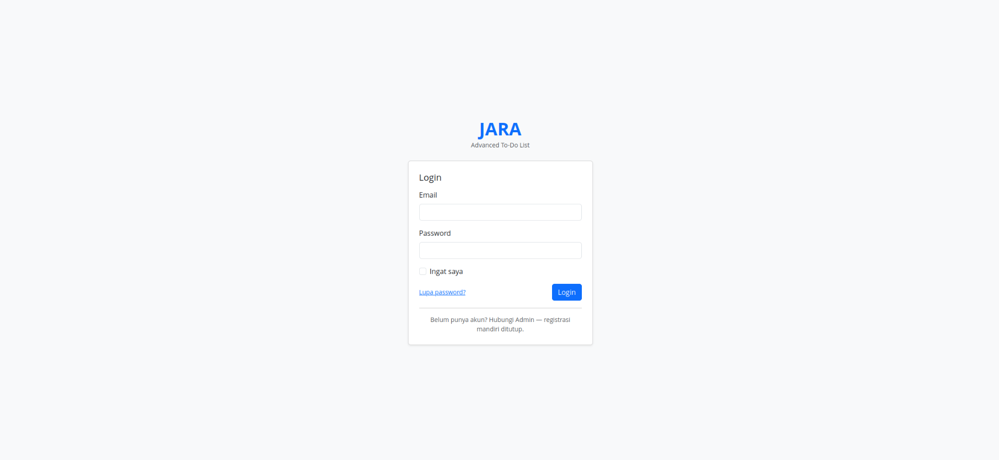
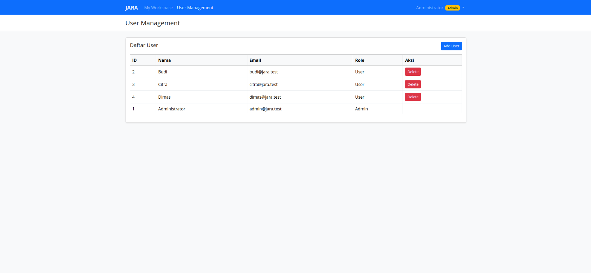
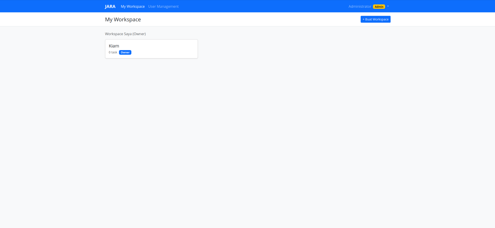
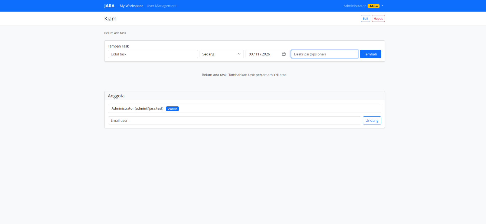
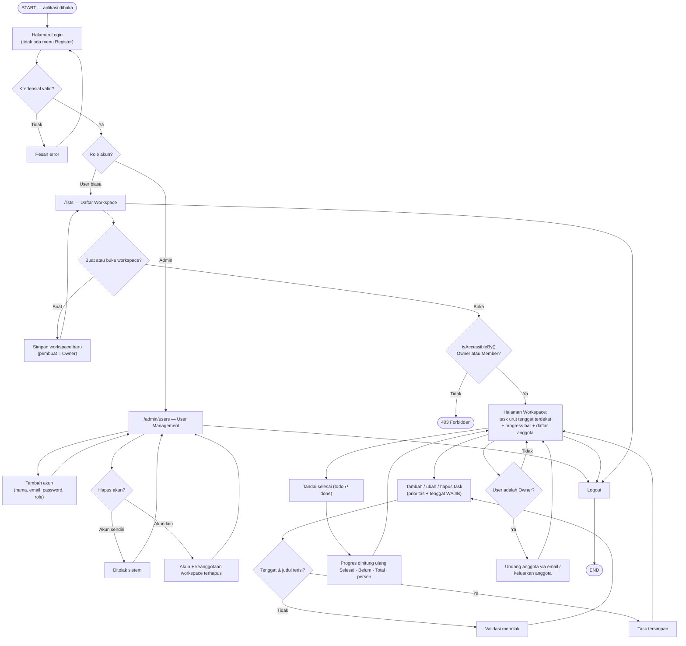
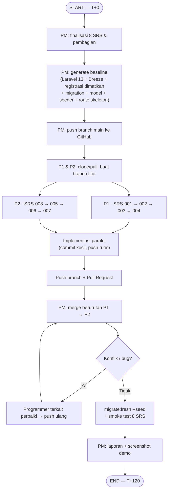

# JARA — Advanced To-Do List


JARA adalah aplikasi to-do list **pribadi + tim** berbasis **multi-workspace**. Satu pengguna dapat
memiliki banyak workspace (misalnya *Kantor*, *Kuliah*, *Project Website*), menambahkan task dengan
**prioritas** dan **tenggat waktu wajib**, menandai task selesai, mengundang anggota, dan memantau
progres tim.

| Info | Keterangan |
|---|---|
| Proyek | JARA — to-do list pribadi + tim (multi-workspace) |
| Tim | 1 PM + 2 Programmer (P1: SRS-001–004 · P2: SRS-005–008) |
| Stack | Laravel 13 · MySQL 8.0 · Blade · Breeze · Bootstrap 5 (CDN) · PHP 8.3+ |
| Durasi | ± 2 jam |
| Aturan kunci | Registrasi mandiri **DITUTUP** (akun hanya dibuat Admin) · `due_date` **WAJIB** · prioritas penting/sedang/rendah |

> Proyek Praktikum PPK-1. Diagram Mermaid di bawah otomatis ter-render di GitHub.

---

## Daftar Isi

1. [Demo Aplikasi](#1-demo-aplikasi)
2. [Peran & Pembagian Tugas](#2-peran--pembagian-tugas)
3. [Alur Bisnis JARA](#3-alur-bisnis-jara--start-hingga-end)
4. [Alur Kerja Tim](#4-alur-kerja-tim-2-jam)
5. [Titik Rawan & Cara Menghindarinya](#5-titik-rawan--cara-menghindarinya)
6. [Checklist Selesai](#6-checklist-selesai-definition-of-done)
7. [Cara Menjalankan](#7-cara-menjalankan)
8. [Akun Demo](#8-akun-demo)

---

## 1. Demo Aplikasi

### Halaman Login
Tidak ada menu **Register** — akun baru hanya bisa dibuat oleh Admin.



### User Management (Admin)
Setelah login, Admin diarahkan ke `/admin/users`: daftar semua akun beserta role, tombol
**Add User**, dan tombol **Delete** (akun sendiri tidak bisa dihapus).



### My Workspace
Daftar workspace yang dimiliki (**Owner**) maupun yang diikuti sebagai anggota (**Member**),
lengkap dengan jumlah task dan tombol **Buat Workspace**.



### Detail Workspace
Form tambah task (judul, prioritas, **tenggat wajib**, deskripsi), progres, serta daftar
anggota dengan form **Undang** via email. Tombol Edit/Hapus workspace hanya tampil untuk Owner.



---

## 2. Peran & Pembagian Tugas

| Peran | Branch | SRS | File utama yang dimiliki |
|---|---|---|---|
| **PM** | `main` | — | Baseline (migration, model, layout, seeder), merge, laporan |
| **P1** | `feature/auth-lists-tasks` | 001–004 | `DashboardController`, `ListController`, `TaskController`, `views/lists/**` (kecuali `partials/`), `views/tasks/**`, section `[P1]` |
| **P2** | `feature/status-collab-admin` | 005–008 | `TaskStatusController`, `MemberController`, `Admin/UserController`, `EnsureUserIsAdmin`, `views/lists/partials/**`, `views/admin/**`, `bootstrap/app.php`, section `[P2]` |

**Aturan emas:** dua programmer tidak pernah mengedit file yang sama. Kebutuhan di luar scope
ditulis sebagai blok `### HANDOFF UNTUK PM`.

| ID | SRS | PIC |
|---|---|---|
| 001 | Login/logout (tanpa registrasi) | P1 |
| 002 | Workspace CRUD | P1 |
| 003 | Task CRUD | P1 |
| 004 | Prioritas & tenggat wajib | P1 |
| 005 | Tandai selesai (toggle) | P2 *(pengecatan tercoret/hijau: P1)* |
| 006 | Kolaborasi (undang/keluarkan anggota) | P2 |
| 007 | Monitoring progres | P2 |
| 008 | Administrasi pengguna (Admin) | P2 |

### Tiga Peran Pengguna

| Peran | Level | Hak utama |
|---|---|---|
| 👑 **Admin** | sistem (`users.role = admin`) | Menambah & menghapus akun di `/admin/users` |
| 🛡 **Owner** | per workspace | Buat/ubah/hapus workspace, undang & keluarkan anggota, pantau progres |
| 👥 **Member** | per workspace | Lihat task, tambah/ubah task, tandai selesai |

---

## 3. Alur Bisnis JARA — Start hingga End



---

## 4. Alur Kerja Tim (±2 jam)



### Rundown

| Menit | Aktivitas | PIC |
|---|---|---|
| 0–10 | Briefing; PM mulai baseline; programmer pahami SRS & siapkan prompt AI | Semua |
| 10–25 | Baseline push `main`; anggota pull, `php artisan serve`, buat branch | PM → semua |
| 25–85 | Implementasi paralel per branch | P1, P2 |
| 85–105 | Merge bertahap P1 → P2 + resolve konflik | PM |
| 105–115 | `migrate:fresh --seed`, smoke test 8 SRS, bugfix kecil | Semua |
| 115–120 | Screenshot, finalisasi laporan, siap demo | PM |

---

## 5. Titik Rawan & Cara Menghindarinya

| Risiko | Solusi yang sudah disepakati |
|---|---|
| Dua orang edit `TaskController` | Dipisah: `TaskController` (P1) vs `TaskStatusController` (P2) |
| Partial belum ada saat branch diuji | P1 memanggil dengan `@includeIf(...)` → aman dilewati |
| Konflik `routes/web.php` | Section berkomentar `[P1]` / `[P2]`, saat merge ambil kedua blok |
| Konflik `bootstrap/app.php` | Hanya P2 yang boleh mengubah (alias middleware `admin`) |
| `route()` error saat branch terpisah | Navigasi & form pakai URL literal (`/lists`, `/admin/users`) |
| Tombol toggle "bolong" | Smoke test SRS-005 dijalankan **setelah** kedua merge |

---

## 6. Checklist Selesai (Definition of Done)

- [x] Kedua branch ter-merge ke `main` tanpa konflik tersisa
- [ ] Dari nol: `clone` → `composer install` → `.env` → `migrate --seed` → `serve` berjalan
- [ ] `/register` → 404; akun baru hanya lahir dari `/admin/users`
- [ ] Simpan task tanpa tenggat → ditolak validasi; task urut tenggat terdekat
- [ ] Toggle selesai → judul tercoret + hijau, progres "Selesai X · Belum Y · Z%" ikut berubah
- [ ] Owner undang member by email → muncul → dikeluarkan → hilang
- [ ] Non-member buka workspace orang lain → 403
- [ ] Setiap programmer mampu menjelaskan kode pada scope-nya

---

## 7. Cara Menjalankan

### Opsi A — PHP & MySQL lokal

```bash
git clone https://github.com/PPK-WP/Praktikum1.git
cd Praktikum1
composer install
cp .env.example .env
php artisan key:generate
```

Buat database di MySQL 8.0, lalu sesuaikan `DB_*` di `.env` (default: `DB_DATABASE=jara`, `DB_USERNAME=root`):

```sql
CREATE DATABASE jara CHARACTER SET utf8mb4 COLLATE utf8mb4_unicode_ci;
```

```bash
php artisan migrate:fresh --seed
php artisan serve
```

Buka **http://localhost:8000**.

### Opsi B — Laravel Sail (Docker)

Ubah bagian database di `.env`:

```env
APP_PORT=8000
DB_HOST=mysql
DB_DATABASE=laravel
DB_USERNAME=sail
DB_PASSWORD=password
```

```bash
./vendor/bin/sail up -d
./vendor/bin/sail artisan migrate:fresh --seed
```

Buka **http://localhost:8000** · matikan dengan `./vendor/bin/sail stop`.

---

## 8. Akun Demo

Akun berikut dibuat otomatis oleh seeder (`php artisan migrate:fresh --seed`).

| Peran | Email | Password | Keterangan |
|---|---|---|---|
| 👑 Admin | `admin@jara.test` | `password` | Masuk ke *User Management* — tambah & hapus akun |
| 🛡 Owner | `budi@jara.test` | `password` | Pemilik workspace *Kantor*, *Kuliah*, dan *Project Website* |
| 👥 Member | `citra@jara.test` | `password` | Anggota workspace *Project Website* |
| 👥 Member | `dimas@jara.test` | `password` | Anggota workspace *Project Website* |

Workspace **Project Website** berisi 4 task (2 sudah selesai → progres 50%) dengan kombinasi
prioritas Penting/Sedang/Rendah; beberapa task sudah lewat tenggat sehingga tampil merah.

> ⚠️ Akun di atas hanya untuk demo lokal — jangan dipakai di server produksi.
