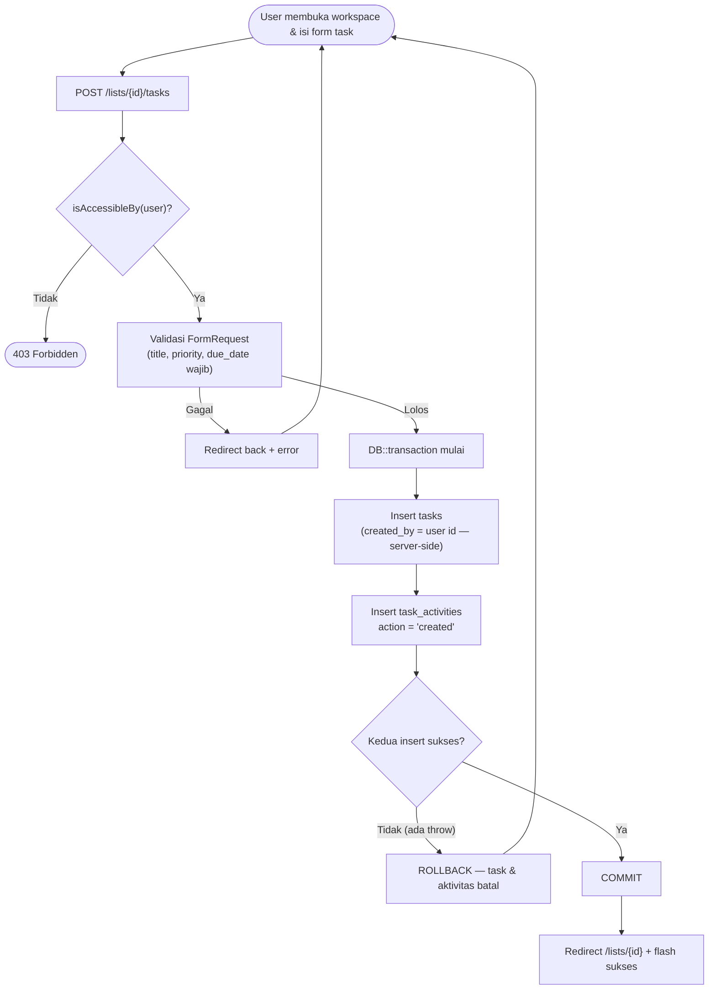
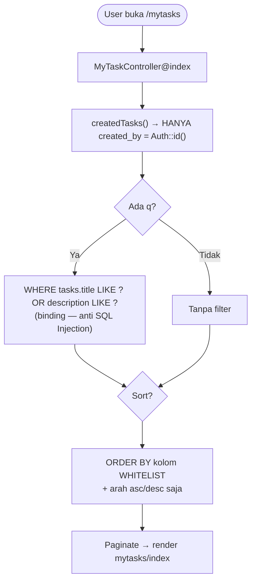
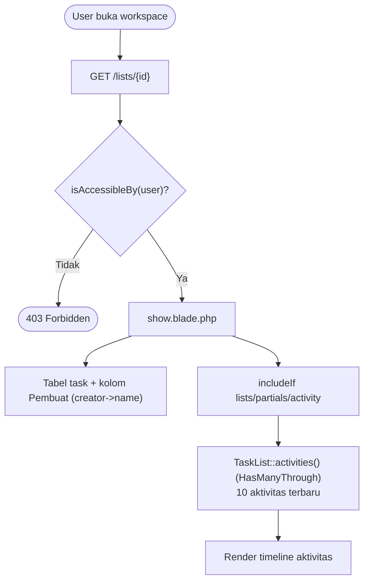

# 📋 SRS PERTEMUAN 3 — PROYEK JARA (Advanced To-Do List)

| Info | Keterangan |
|---|---|
| Kelompok | `[isi nomor kelompok]` |
| Anggota | PM: `[nama]` · Programmer 1: `[nama]` · Programmer 2: `[nama]` · Programmer 3: `[nama]` |
| Studi kasus | Pertemuan 3 PPK — **Auto-Owner Task, Proses Atomik & Anti SQL Injection** (lanjutan JARA pertemuan 2) |
| Stack | Laravel 13 (`laravel/framework ^13.17`) · MySQL Server 8.0 · Templating Blade · Laravel Breeze (stack Blade) · Bootstrap 5 (CDN) · PHP 8.3+ |
| Durasi | ± 2 jam |
| Basis kode | `main` hasil merge pertemuan 2 (SRS-001 s.d. SRS-008 sudah ter-merge mulus) |

> Diagram **Mermaid** otomatis ter-render di GitHub dan VS Code (ekstensi *Markdown Preview Mermaid*).

---

## 1. User Story Baru (pertemuan 3)

> **"Pengguna dapat membuat tugas baru otomatis dengan pemiliknya. Setiap proses harus berjalan atomik — jika salah satu gagal, maka semuanya akan gagal. Setiap pengguna yang tidak berwenang akan ditolak, dan semua data harus divalidasi memakai Prepared Statement. Pastikan tidak terjadi SQL Injection."**

### 1.1 Penjabaran kebutuhan menjadi aturan bisnis

| No | Aturan bisnis (diturunkan dari user story) |
|---|---|
| 1 | Setiap **task baru** otomatis tercatat **pemiliknya (created_by)** = pengguna yang sedang membuat. Nilai ini ditentukan **server-side** (dari `Auth::id()`), **tidak pernah** diambil dari input client (anti mass-assignment injection). |
| 2 | Proses >1 operasi simpan dibungkus **satu transaksi database** (`DB::transaction`). Jika satu operasi gagal (`throw`), **semua di-rollback** — tidak ada data setengah jadi. |
| 3 | Untuk menguji atomik: proses pembuatan task = **insert task + insert catatan aktivitas (`task_activities`)**. Salah satu gagal → task pun tidak tersimpan. |
| 4 | **Otorisasi tetap berlaku**: hanya Owner/Member workspace (`List::isAccessibleBy()`) yang boleh create/edit/hapus/toggle task; halaman "Tugas Saya" hanya menampilkan task miliknya. User tidak berwenang → **403**. |
| 5 | Semua query memakai **Prepared Statement (parameter binding)**. **DILARANG** merangkai string user ke dalam SQL (`"...'$cari'..."`). Untuk kondisi `LIKE`/dinamis, wajib binding `?`/named. |
| 6 | Kolom untuk `ORDER BY`/`sort` dinamis diambil dari **whitelist**, arah hanya `asc/desc` — mencegah SQL Injection lewat klausa sort. |
| 7 | Pemilik task tampil di daftar task workspace, di halaman "Tugas Saya", dan pada **catatan aktivitas (audit trail)** per workspace. |

### 1.2 Traceability: User Story → SRS baru

| Pernyataan user story | Dipenuhi oleh |
|---|---|
| Membuat tugas baru otomatis dengan pemiliknya | **SRS-009** (set `created_by` server-side) + **SRS-011** (tampilkan Pembuat) |
| Proses berjalan atomik — jika gagal semua gagal | **SRS-009** (`DB::transaction`: task + activity) |
| Pengguna tidak berwenang ditolak | **SRS-009** (`isAccessibleBy`), **SRS-010** (hanya task milikku) |
| Divalidasi memakai Prepared Statement / anti SQL Injection | **SRS-009** (FormRequest + query builder), **SRS-010** (binding `?` + whitelist sort) |

---

## 2. Analisis Codebase Saat Ini (hasil pertemuan 2)

Setelah analisis seluruh folder/file `Praktikum1`, kondisi baseline `main` saat ini:

- **Skema DB (PM pertemuan 2):** `users`, `lists`, `tasks`, `list_user`. Kolom `tasks` saat ini: `id, list_id, title, description, priority, due_date (WAJIB), status, timestamps` — **belum ada kolom pemilik task**.
- **Model:** `App\Models\User` (mailto:`lists`, `memberLists`, `isAdmin`), `App\Models\TaskList` (tabel `lists`; `owner`, `members`, `tasks` orderBy `due_date`, `isAccessibleBy`, `progressPercentage`), `App\Models\Task` (`list`, `scopeDone`, `casts` due_date → date). Konvensi: `#[Fillable]` (attribute), method `casts()`.
- **Controller:** `DashboardController`, `ListController`, `TaskController` (store/edit/update/destroy — validated, `isAccessibleBy`), `TaskStatusController` (toggle), `MemberController`, `Admin\UserController`, `ProfileController`, `Auth\*`.
- **Middleware:** `EnsureUserIsAdmin` terdaftar alias `'admin'` di `bootstrap/app.php`.
- **Routes:** `routes/web.php` punya 2 section berkomentar `[P1]` dan `[P2]` yang sudah terisi; navigasi & form memakai **URL literal** (bukan `route()`).
- **Views:** `lists/*` (index, create, edit, show), `tasks/edit`, `lists/partials/*` (toggle, progress, members), `admin/users/*`, layout `x-app-layout` + Bootstrap 5 CDN.
- **Seeder:** `AdminSeeder` (admin@jara.test) & `DemoSeeder` (budi/citra/dimas).

> Data demo menunjukkan bahwa user story level **"statistik kontribusi per anggota"** membuthkan kolom penugasan/pemilik task — tepatnya yang menjadi **fokus pertemuan 3** ini.

---

## 3. Perubahan Skema Database (BASELINE PM — Programmer DILARANG menyentuh)

PM menambahkan **2 migration baru + menyempurnakan model** SEBELUM programmer bercabang. Ini satu-satunya perubahan database di pertemuan 3.

### 3.1 Migration 1 — `add_created_by_to_tasks`

Menambah kolom pemilik pada tabel `tasks` (nullable karena diisi otomatis saat create; `nullOnDelete` — bila user dihapus, task tetap ada tapi `created_by` menjadi `null`):

```php
$table->foreignId('created_by')->after('list_id')->nullable()->constrained('users')->nullOnDelete();
```

**Backfill data lama** (SQL statis tanpa input user — aman): semua task lama menyerap pemilik workspace-nya.

```php
DB::statement('UPDATE tasks t JOIN lists l ON l.id = t.list_id SET t.created_by = l.owner_id WHERE t.created_by IS NULL');
```

### 3.2 Migration 2 — `create_task_activities_table`

Tabel catatan aktivitas (dipakai sebagai "operasi kedua" pada transaksi atomik + audit trail):

| Kolom | Tipe |
|---|---|
| `id` | bigint PK |
| `task_id` | FK → tasks (cascade on delete) |
| `user_id` | FK → users (cascade on delete) |
| `action` | enum('created','updated','completed','deleted') |
| `created_at` | timestamp (cukup `timestamps()` dengan nullable updated_at) |

### 3.3 Model yang disempurnakan PM (baseline)

- **`App\Models\Task`** — tambah `'created_by'` pada `#[Fillable]` + relasi:
  ```php
  public function creator(): BelongsTo
  {
      return $this->belongsTo(User::class, 'created_by');
  }
  ```
- **`App\Models\TaskActivity`** — model BARU (`$table = 'task_activities'`):
  ```php
  #[Fillable(['task_id', 'user_id', 'action'])]
  class TaskActivity extends Model
  {
      protected $table = 'task_activities';

      public function task(): BelongsTo { return $this->belongsTo(Task::class); }
      public function user():  BelongsTo { return $this->belongsTo(User::class); }
  }
  ```

### 3.4 Seeder

- `DemoSeeder`: setiap task diberi `created_by` eksplisit (task milik budi → budi; pada workspace tim "Project Website" buat variasi: budi 2 task, **citra 1 task, dimas 1 task** agar tampilan Pembuat & aktivitas langsung terbukti). Tambahkan beberapa baris `task_activities` yang konsisten (`created`/`completed`) untuk data demo.

### 3.5 Perintah PM

```bash
php artisan make:migration add_created_by_to_tasks_table
php artisan make:migration create_task_activities_table
php artisan make:model TaskActivity
# edit seluruh file sesuai §3.1–3.4, lalu:
php artisan migrate:fresh --seed   # verifikasi di branch main
```

> Hasil baseline ini WAJIB dipush ke `main` agar ketiga programmer bercabang dari basis yang sama (model `TaskActivity`, kolom `created_by`, relasi `creator()` sudah tersedia untuk semua).

---

## 4. Struktur Tim Pertemuan 3, Branch & Kepemilikan File

Aturan emas tetap: **tiga programmer tidak pernah mengedit file yang sama.**

| Peran | Branch | SRS | File yang BOLEH dibuat/diubah | DILARANG menyentuh |
|---|---|---|---|---|
| **PM** | `main` | — (baseline + merge) | migration `2026_09_18_*`, `Task.php`, `TaskActivity.php`, `DemoSeeder.php`, `CLAUDE.md`, dokumen SRS ini | Semua file milik programmer di bawah |
| **Programmer 1** | `feature/task-owner-atomic` | SRS-009 | `app/Http/Controllers/TaskController.php`, `app/Http/Controllers/TaskStatusController.php`, `app/Http/Requests/TaskStoreRequest.php` (baru) | migration, model, views, `routes/web.php`, `bootstrap/app.php` |
| **Programmer 2** | `feature/mytasks-search` | SRS-010 | `app/Models/User.php`, `app/Http/Controllers/MyTaskController.php` (baru), `resources/views/mytasks/index.blade.php` (baru), `routes/web.php` (section `[PR3-P2]`), `resources/views/layouts/navigation.blade.php` | controller/model/view milik P1 & P3, section route lama |
| **Programmer 3** | `feature/activity-audit` | SRS-011 | `app/Models/TaskList.php`, `resources/views/lists/show.blade.php`, `resources/views/lists/partials/activity.blade.php` (baru) | controller, `routes/web.php`, model Task/TaskActivity |

**Kunci anti-conflict:**

| Titik rawan | Solusi |
|---|---|
| `routes/web.php` | Hanya **P2** yang menambah route (section baru `[PR3-P2]`), P1 & P3 **tidak menyentuh** file ini |
| `resources/views/lists/show.blade.php` | Hanya **P3** yang mengedit |
| `navigation.blade.php` | Hanya **P2** yang mengedit (link "Tugas Saya") |
| `TaskController` / `TaskStatusController` | Hanya **P1** |
| Model `Task`, `TaskActivity`, migration, seeder | **PM baseline** — tidak ada programmer yang mengubah |
| Model `User` vs `TaskList` | P2 pemilik `User.php`, P3 pemilik `TaskList.php` (berbeda file) |

---

## 5. SRS-009 — AUTO-OWNER & PROSES ATOMIK *(Programmer 1)*

**Branch:** `feature/task-owner-atomic` · **File milikku:** `TaskController.php`, `TaskStatusController.php`, `TaskStoreRequest.php`.

### 5.1 Deliverable

`app/Http/Requests/TaskStoreRequest.php` (baru)
- Validasi untuk store **dan** update task:
  ```php
  'title'       => ['required', 'string', 'max:255'],
  'description' => ['nullable', 'string', 'max:1000'],
  'priority'    => ['required', Rule::in(['penting', 'sedang', 'rendah'])],
  'due_date'    => ['required', 'date'],
  ```
- **TIDAK** ada aturan `created_by` — kolom ini dilarang dari request.

`app/Http/Controllers/TaskController.php`
- `store(Request $request, TaskList $list)`:
  1. `abort_unless($list->isAccessibleBy(auth()->user()), 403);` (otorisasi — user tak berwenang ditolak).
  2. Validasi via `TaskStoreRequest`.
  3. **Transaksi atomik**:
     ```php
     $task = DB::transaction(function () use ($list, $validated) {
         $task = $list->tasks()->create([
             ...$validated,
             'created_by' => auth()->id(),   // SERVER-SIDE, tidak pernah dari request
         ]);

         TaskActivity::create([
             'task_id' => $task->id,
             'user_id' => auth()->id(),
             'action'  => 'created',
         ]);

         return $task;
     });
     ```
  4. Redirect `/lists/{id}` + flash.
- `update()`: dibungkus `DB::transaction` + log `TaskActivity` action `'updated'`.
- `destroy()`: dibungkus `DB::transaction` (hapus task + log `'deleted'` setelah/bersama) — urutan aman: catat aktivitas **terlebih dahulu** lalu hapus task, atau hapus pivot; pastikan keduanya dalam satu transaksi agar konsisten.

`app/Http/Controllers/TaskStatusController.php`
- `toggle(Task $task)`:
  1. `abort_unless($task->list->isAccessibleBy(auth()->user()), 403);`
  2. `DB::transaction`: flip status (`todo ⇄ done`) + log `TaskActivity` → action `'completed'` jika jadi `done`, `'updated'` jika kembali `todo`.

### 5.2 Aturan keamanan wajib

- `created_by`, `user_id`, dan `action` **selalu server-side** — jangan pernah baca dari input.
- Semua query memakai Eloquent/Query Builder (PDO prepared). Dilarang `->whereRaw`/`DB::select` dengan interpolasi string user.
- Route tidak berubah (POST/PUT/DELETE `/lists/{list}/tasks...` & PATCH `/tasks/{task}/toggle` sudah ada).

### 5.3 SELESAI JIKA (uji di branch-ku sendiri)

1. User (owner/member) membuat task → `created_by` = id user tsb, dan muncul baris `task_activities` action `created`.
2. **Bukti atomik:** sementara ubah action menjadi nilai enum yang TIDAK valid (`TaskActivity::create(['action' => 'xyz'])`) → task ikut **tidak tersimpan** (rollback). Setelah diverifikasi, kembalikan ke kode benar.
3. Toggle task → activity `completed`/`updated` ikut tercatat.
4. Non-member membuka/aksi workspace orang lain → **403**.
5. Task yang diedit/dihapus → activity `updated`/`deleted` tercatat.

---

## 6. SRS-010 — "TUGAS SAYA" + PENCARIAN AMAN *(Programmer 2)*

**Branch:** `feature/mytasks-search` · **File milikku:** `User.php`, `MyTaskController.php`, `resources/views/mytasks/index.blade.php`, `routes/web.php` (section `[PR3-P2]`), `navigation.blade.php`.

### 6.1 Deliverable

`app/Models/User.php`
- Tambah relasi task yang **aku buat** (pemilik):
  ```php
  use App\Models\Task;

  public function createdTasks(): HasMany
  {
      return $this->hasMany(Task::class, 'created_by');
  }
  ```

`app/Http/Controllers/MyTaskController.php` (baru)
- `index(Request $request)`:
  1. Mulai dari **task milikku saja**: `auth()->user()->createdTasks()` (+ eager load `list.owner` dan `creator`).
  2. Filter pencarian `q` — **Prepared Statement eksplisit** (parameter binding `?`):
     ```php
     if ($q = trim($request->query('q', ''))) {
         $query->whereRaw('(tasks.title LIKE ? OR tasks.description LIKE ?)', ["%{$q}%", "%{$q}%"]);
     }
     ```
     > **DILARANG** menulis `->whereRaw("title LIKE '%$q%'")` → ini SQL Injection.
  3. Sort dinamis via **whitelist** (jangan pernah meneruskan nama kolom dari user langsung):
     ```php
     $sortable = ['title' => 'tasks.title', 'due_date' => 'tasks.due_date', 'priority' => 'tasks.priority', 'status' => 'tasks.status'];
     $col  = $sortable[$request->query('sort', 'due_date')] ?? 'tasks.due_date';
     $dir  = in_array($request->query('dir', 'asc'), ['asc', 'desc'], true) ? $request->query('dir') : 'asc';
     $query->orderBy($col, $dir);
     ```
  4. `paginate(15)` → view.

`resources/views/mytasks/index.blade.php` (baru)
- Tabel: Task (judul + deskripsi ringkas) · Workspace (link `/lists/{id}`) · Prioritas (badge) · Tenggat · Status · **Pembuat** (`$task->creator?->name ?? '—'`).
- Form GET search `q` + dropdown sort (kolom whitelist) + arah asc/desc.
- Empty state: "Kamu belum membuat tugas apa pun" / "Tidak ditemukan".

`routes/web.php`
- Tambah **section komentar baru** `[PR3-P2] MY TASKS & SEARCH — SRS-010` (di bawah section `[P2]` lama, JANGAN mengubah isi section lama):
  ```php
  Route::get('/mytasks', [MyTaskController::class, 'index'])
      ->middleware('auth')
      ->name('mytasks.index');
  ```

`resources/views/layouts/navigation.blade.php`
- Tambah link "Tugas Saya" → `/mytasks` (URL literal, aktif bila `request()->is('mytasks*')`).

### 6.2 Keamanan wajib

- Halaman hanya menampilkan task dengan `created_by = Auth::id()` — task milik orang lain tidak pernah muncul, meskipun sesama member workspace.
- `ORDER BY` hanya dari whitelist; arah hanya `asc/desc`.
- Search selalu `LIKE ?` (binding). Tidak ada interpolasi SQL.

### 6.3 SELESAI JIKA (uji di branch-ku sendiri)

1. `budi@jara.test` buka `/mytasks` → hanya task yang budi buat (tidak ada task milik citra/dimas walau sesama member).
2. Search "laporan" → hasil terfilter benar; search **payload injeksi** `'; DROP TABLE tasks;--` → hasil **kosong**, tabel `tasks` tetap aman/ada.
3. Sort `?sort=priority&dir=desc` bekerja; `?sort=abc` → fallback default (tidak error/ter-inject).
4. Tanpa login → redirect `/login`.

---

## 7. SRS-011 — AUDIT TRAIL & TAMPILAN PEMILIK *(Programmer 3)*

**Branch:** `feature/activity-audit` · **File milikku:** `TaskList.php`, `lists/show.blade.php`, `lists/partials/activity.blade.php`.

### 7.1 Deliverable

`app/Models/TaskList.php`
- Tambah relasi aktivitas lintas `lists → tasks → task_activities`:
  ```php
  use App\Models\TaskActivity;
  use Illuminate\Database\Eloquent\Relations\HasManyThrough;

  public function activities(): HasManyThrough
  {
      return $this->hasManyThrough(
          TaskActivity::class,    // relasi tersebut
          Task::class,            // lewat tasks
          'list_id',              // kolom FK tasks → lists
          'task_id',              // kolom FK task_activities → tasks
          'id',                   // PK lists
          'id'                    // PK tasks
      )->latest('task_activities.created_at')->limit(10);
  }
  ```

`resources/views/lists/partials/activity.blade.php` (baru)
- Judul **"Aktivitas Terbaru"**.
- Timeline ringkas memakai `$list->activities` (sudah di-*load* — jika belum, panggil `$list->load('activities')` di controller **milik P1 saja?** NO — aturan: P3 tidak menyentuh controller; maka gunakan `@php $list->loadMissing('activities') @endphp` di dalam partial, atau cukup `$list->activities` karena Lazy Loading Eloquent sudah otomatis). Contoh baris:
  - "**Budi** membuat task _Implementasi halaman_ (2 menit lalu)"
  - "**Citra** menandai selesai _ERD database_ (1 jam lalu)"
- Badge/label aksi kecil: created=primary, updated=secondary, completed=success, deleted=danger.
- Empty state: "Belum ada aktivitas di workspace ini."

`resources/views/lists/show.blade.php`
1. Tabel task: tambah kolom **"Pembuat"** → `{{ $task->creator?->name ?? '—' }}` (relasi `creator()` sudah ada di baseline PM).
2. Pasang partial dengan `@includeIf('lists.partials.activity', ['list' => $list])` (pola sama seperti partial toggle/progress/members — aman walau belum ada).

### 7.2 Keamanan

- Halaman `show` sudah dijaga `ListController::show` (`isAccessibleBy`) → user tak berwenang tetap **403**. Partial tidak menambah aksi tulis apa pun.
- Tidak menambah route baru. Tidak menyentuh controller/model lain.

### 7.3 SELESAI JIKA (uji di branch-ku sendiri)

1. Kolom **Pembuat** muncul di daftar task workspace dan benar (budi/citra/dimas sesuai seeder).
2. Aktivitas terbaru (maks 10) tampil di detail workspace; buat task → aktivitas baru muncul (mengingat `TaskActivity` sudah ada di baseline, bisa di-*seed*).
3. Workspace yang tidak aku akses → 403.

---

## 8. Kontrak Interface Antar-Programmer (HARUS dipatuhi agar merge mulus)

1. **Baseline PM menyediakan** (semua programmer boleh memakai, TIDAK boleh mengubah):
   - Kolom `created_by` + relasi `Task::creator(): BelongsTo`.
   - Model `App\Models\TaskActivity` dengan `task()` & `user()`.
   - Tabel `task_activities` dengan enum action `created|updated|completed|deleted`.
2. **`routes/web.php`** hanya P2 yang menambah (section `[PR3-P2]`); route lama `[P1]`/`[P2]` tidak diubah siapa pun.
3. **`resources/views/lists/show.blade.php`** hanya P3 yang mengubah.
4. **Navigasi & action form** tetap memakai **URL literal** (`/lists`, `/mytasks`, `url('/tasks/'.$task->id.'/toggle')`) — bukan `route()`.
5. **Controller tetap terpisah** sesuai kepemilikan tabek §4 — jangan menggabungkan ke satu file.
6. Data `created_by`, `user_id`, `action` **server-side only**.
7. Semua **views** memakai `x-app-layout` + Bootstrap 5 CDN (pola baseline).

---

## 9. Flowchart Alur Proses Baru

### 9.1 Pembuatan task atomik (SRS-009)



### 9.2 "Tugas Saya" + pencarian aman (SRS-010)



### 9.3 Audit trail & tampilan pembuat (SRS-011)



---

## 10. Rundown Pengerjaan (±2 jam, Pertemuan 3)

| Menit | Aktivitas | PIC |
|---|---|---|
| 0–10 | Briefing; PM jelaskan SRS-009/010/011 + batasan scope; programmer pahami kontrak §8 | Semua |
| 10–20 | PM: baseline pertemuan 3 (2 migration + model Task/TaskActivity + seeder + backfill) & push `main`; programmer pull & buat branch masing-masing | PM → semua |
| 20–80 | **Implementasi paralel**: P1 (SRS-009) · P2 (SRS-010) · P3 (SRS-011) — commit kecil, push rutin | P1, P2, P3 |
| 80–100 | **Merge berurutan P3 → P2 → P1** (PM) + resolve konflik (seharusnya nihil, file disjoint) | PM |
| 100–112 | `php artisan migrate:refresh` dan smoke test 3 SRS (§11) + bukti atomicity | Semua |
| 112–120 | Screenshot bukti, finalisasi laporan, `git log --oneline --graph`, siap demo | PM |

---

## 11. Acceptance Criteria (checklist smoke test)

| SRS | Skenario uji (Given–When–Then) |
|---|---|
| **009** | When user (owner/member) membuat task Then task tersimpan dengan `created_by` = dirinya sendiri And muncul baris `task_activities` action `created`. **Given** aksi aktivitas gagal (simulasi enum tak valid) **Then** task ikut tidak tersimpan (rollback atomik). Given non-member mencoba aksi workspace **Then** 403. |
| **010** | Given budi buka `/mytasks` **Then** hanya task buatannya yang muncul (task citra/dimas tidak tampak). When search `q` normal **Then** hasil terfilter benar. When input `'; DROP TABLE tasks;--` **Then** hasil kosong dan tabel tetap aman. When sort kolom tak dikenal **Then** fallback default (tidak error). |
| **011** | Given buka detail workspace **Then** kolom "Pembuat" terisi benar dan timeline "Aktivitas Terbaru" (maks 10) tampil. When buat/toggle task **Then** aktivitas baru muncul. Given user tak berhak membuka workspace **Then** 403. |
| **Cross** | Seluruh `main` tetap lolos smoke test pertemuan 2 (8 SRS) — tidak ada regresi login, CRUD, toggle, kolaborasi, progres, admin. |

---

## 12. Definition of Done

- [ ] 3 branch ter-merge ke `main` (`feature/activity-audit` → `feature/mytasks-search` → `feature/task-owner-atomic`) tanpa konflik tersisa.
- [ ] Dari nol: `composer install` → `.env` → `php artisan migrate:fresh --seed` → `serve` mulus.
- [ ] Kolom `created_by` terisi otomatis server-side; `task_activities` tercatat untuk created/updated/completed/deleted.
- [ ] Bukti atomik: satu operasi gagal → semua rollback (terverifikasi manual/screenshot).
- [ ] Tidak ada SQL Injection: pencarian memakai binding `?`, sort memakai whitelist — payload injeksi aman.
- [ ] Tidak ada user tak berwenang yang lolos (semua 403 sesuai SRS).
- [ ] Tiap programmer mampu menjelaskan kode pada scope-nya.

**Akun demo tetap:** `admin@jara.test` (Admin) · `budi@jara.test` (Owner) · `citra@` & `dimas@jara.test` (Member) — password: `password`. Tambahan data: pada "Project Website", citra & dimas masing-masing membuat minimal 1 task agar tampilan Pembuat + aktivitas terbukti.

---

## 13. Catatan untuk PM (handoff / integrasi)

- Merge **tanpa `--no-ff` tidak wajib**, tapi disarankan sama dengan pertemuan 2 agar grafik jelas.
- Perintah smoke test: `php artisan migrate:fresh --seed && php artisan serve`.
- Jika ada kebutuhan di luar scope, minta programmer menulis blok `### HANDOFF UNTUK PM` di akhir jawabannya (jangan diimplement sendiri).
- Dokumen prompt role per programmer (pola pertemuan 2) dapat diturunkan dari SRS §5–§7: MASTER PROMPT (CLAUDE.md) + bagian peran masing-masing.